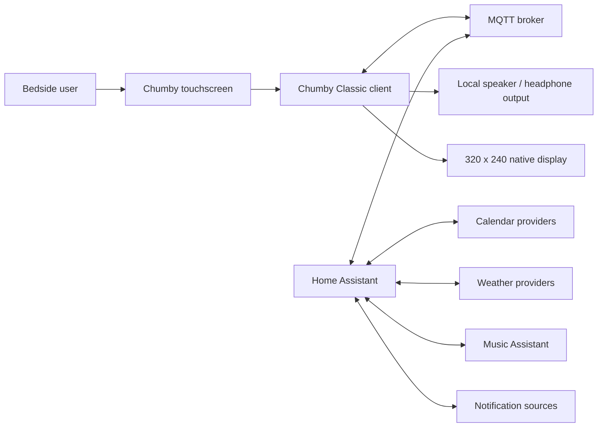
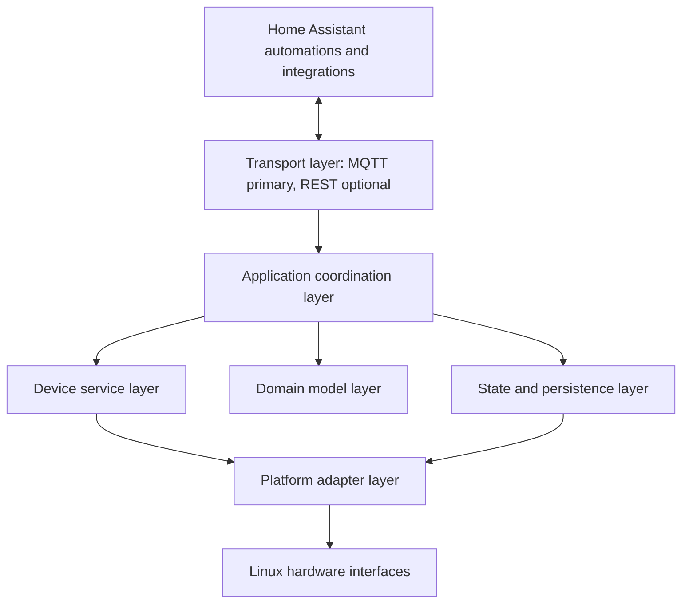
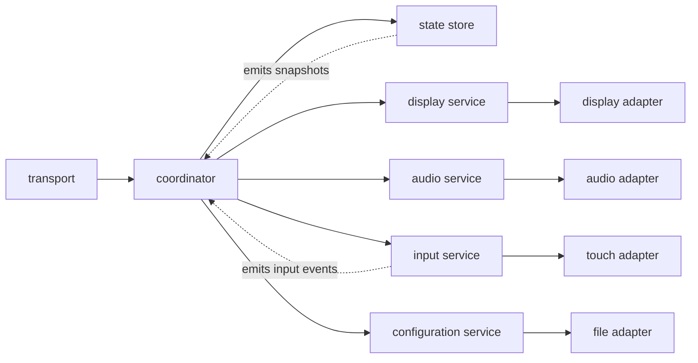
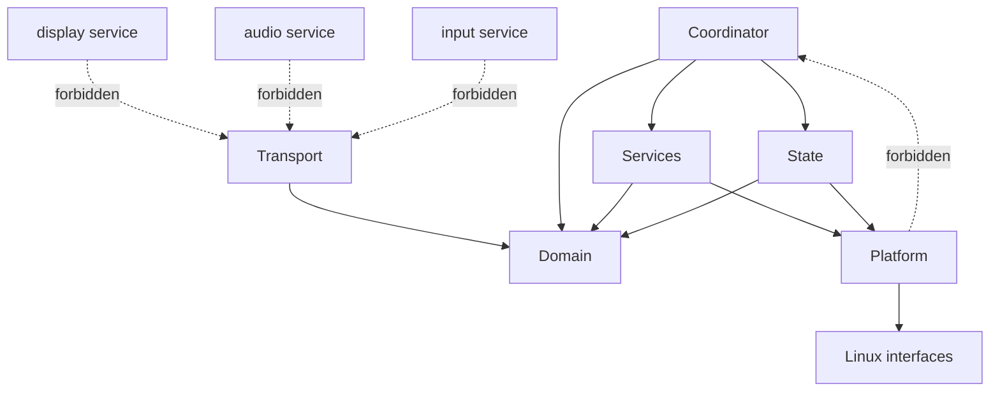
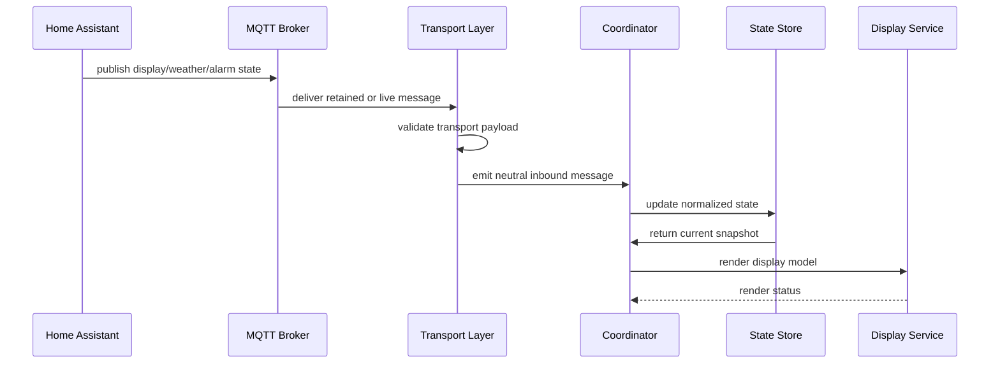
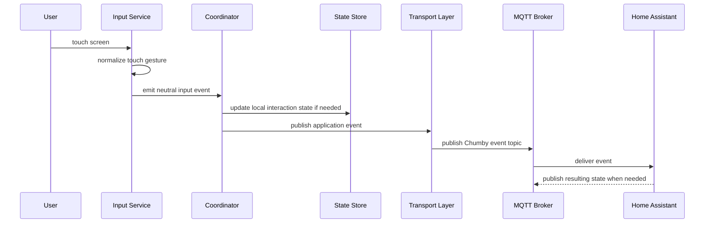
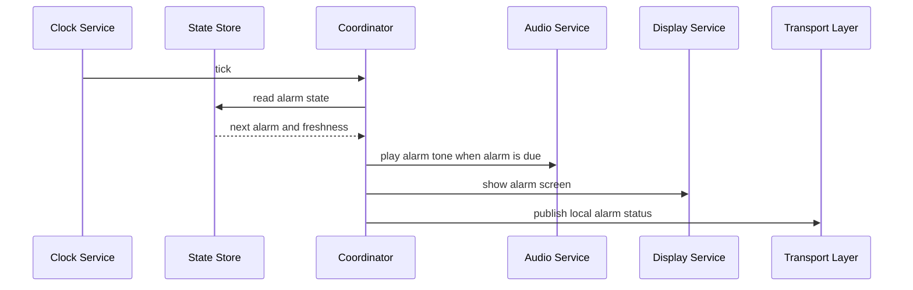
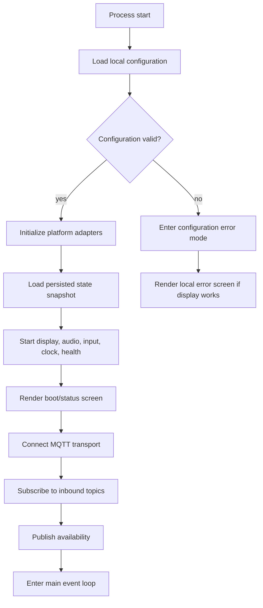
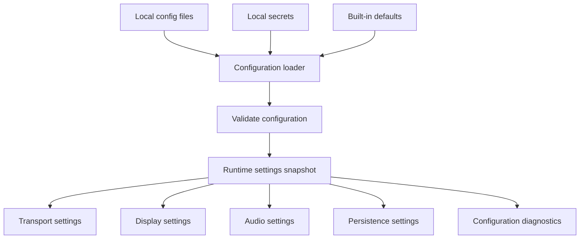

# Software Architecture

Status: Sprint 1.0 architecture design.

Scope: This document defines the intended software architecture for the Chumby Classic Home Assistant companion. It is architecture only. It does not define implementation code, package names, classes, or concrete function signatures.

## Architectural Intent

The Chumby is a thin bedside client. Home Assistant is the brain.

The Chumby runtime should focus on local device responsibilities: render state, play audio, collect touchscreen input, maintain minimal offline state, and exchange messages with Home Assistant. Home Assistant should own automation decisions, calendar logic, weather provider selection, school schedule rules, notification routing, and Music Assistant orchestration.

The architecture must stay modular. No single module should become a hidden monolith that owns transport, state, rendering, audio, input, and configuration together.

## System Context

## Layers

The software is organized into layers. Dependencies flow downward only unless a boundary explicitly defines events flowing upward.

### Home Assistant Layer

Responsibilities:

- Own automation logic.
- Own integration with weather, calendar, school schedule, notifications, and Music Assistant.
- Publish prepared device state to Chumby topics.
- Consume Chumby availability, input, and local status events.
- Remain usable through plain MQTT topics before any custom Home Assistant integration exists.

Non-responsibilities:

- Rendering Chumby UI pixels.
- Reading Chumby hardware devices directly.
- Depending on Chumby implementation internals.

### Transport Layer

Responsibilities:

- Maintain MQTT connectivity.
- Subscribe to Home Assistant to Chumby topics.
- Publish Chumby to Home Assistant events.
- Decode incoming transport payloads into neutral application messages.
- Encode outgoing events from neutral application messages.
- Handle reconnect, retained messages, last will, and availability behavior.
- Provide optional REST request/response support for setup or diagnostics.

Non-responsibilities:

- Rendering screens.
- Playing audio.
- Making alarm decisions.
- Embedding Home Assistant automation logic inside the Chumby.

### Application Coordination Layer

Responsibilities:

- Route normalized messages between transport, state, display, audio, input, and configuration.
- Apply high-level lifecycle behavior such as startup, offline mode, stale-state handling, and shutdown.
- Enforce module boundaries.
- Convert local input events into publishable application events.
- Decide which local service should react to a state change.

Non-responsibilities:

- Direct hardware access.
- Topic-specific parsing details.
- Low-level rendering primitives.
- Persistent storage implementation details.

### Domain Model Layer

Responsibilities:

- Define neutral concepts such as display state, alarm state, weather state, schedule item, notification, music state, device health, and input event.
- Keep transport-independent state shapes.
- Keep display-independent business meaning.
- Provide vocabulary shared by modules.

Non-responsibilities:

- MQTT topic handling.
- JSON schema parsing.
- SDL2 or framebuffer rendering.
- Home Assistant API calls.

### State and Persistence Layer

Responsibilities:

- Store current normalized state.
- Store last known useful state for offline operation.
- Track freshness and staleness.
- Persist local configuration.
- Persist only the minimum state needed for recovery and offline bedside behavior.

Non-responsibilities:

- Treating cached state as more authoritative than Home Assistant after reconnect.
- Rendering stale-state indicators directly.
- Owning transport connections.

### Device Service Layer

Responsibilities:

- Provide display service, audio service, input service, clock service, health service, and optional diagnostics service.
- Expose device capabilities through clean service contracts.
- Hide platform-specific details from application coordination.

Non-responsibilities:

- Parsing Home Assistant-specific payloads.
- Knowing MQTT topic names.
- Owning persistent configuration format.

### Platform Adapter Layer

Responsibilities:

- Encapsulate Linux device paths, process calls, framebuffer access, audio commands, touchscreen reads, system clock reads, and file storage.
- Isolate Chumby Classic quirks from the rest of the architecture.
- Provide replaceable adapters for test harnesses or future firmware variants.

Non-responsibilities:

- Deciding alarm behavior.
- Deciding screen flow.
- Owning domain state.

## Module Boundaries

### Transport Module Boundary

The transport module owns protocol mechanics. MQTT topics, retained-message behavior, availability messages, and optional REST endpoints belong here.

The transport module accepts and emits neutral messages at its boundary. Other modules should not know whether a message arrived over MQTT, REST, a replay file, or a local test harness.

### State Module Boundary

The state module owns normalized current state and persisted snapshots. It exposes snapshots to consumers. It should not push raw MQTT payloads into display, audio, or input modules.

### Display Module Boundary

The display module renders from a display model. It should not import Home Assistant integration code, subscribe to MQTT, read transport payloads, or fetch remote data.

The display module may request redraws, report render health, and expose screen-level input regions to the input service through a neutral boundary.

### Audio Module Boundary

The audio module owns local sound behavior. It receives audio intents such as alarm tone, notification tone, volume update, mute update, and playback control feedback.

The audio module does not decide when an alarm should ring. It only executes local audio intents from the coordinator.

### Input Module Boundary

The input module owns touchscreen sampling and gesture normalization. It emits neutral input events such as tap, long press, dismiss alarm, snooze alarm, next screen, previous screen, or music control.

The input module does not publish MQTT events directly. The coordinator and transport layer decide what leaves the device.

### Configuration Module Boundary

The configuration module owns loading, validating, and exposing local configuration. It separates non-secret settings from secrets where practical.

Other modules should receive configuration through typed settings or capability descriptions, not by reading configuration files directly.

### Home Assistant Boundary

Home Assistant communicates through MQTT first. A custom integration may exist later, but the Chumby runtime should remain functional with documented MQTT topics alone.

## Dependency Rules

Rules:

- Domain concepts have no dependency on transport, platform, rendering, or Home Assistant code.
- Transport depends on domain message definitions, not on display, audio, or input services.
- Display, audio, and input services do not depend on MQTT topic names.
- Platform adapters do not call the coordinator.
- Home Assistant-specific parsing stays outside display, audio, input, and platform adapters.
- Offline state handling belongs in application coordination and state, not in transport adapters.
- Hardware quirks stay behind platform adapter boundaries.
- Application code must not be added before the relevant design or research documentation exists.

## Interfaces

Interfaces here are architectural contracts, not implementation signatures.

### Inbound Transport Interface

Purpose: move Home Assistant-originated data into the Chumby runtime.

Inputs:

- Display command or display state.
- Alarm state.
- Weather state.
- Calendar and school schedule state.
- Music state.
- Notification event.
- Configuration update when supported.

Output:

- Validated neutral application message.

Failure behavior:

- Invalid messages are rejected and reported through diagnostics.
- Last known good state remains active unless explicitly cleared.

### Outbound Transport Interface

Purpose: publish Chumby-originated observations to Home Assistant.

Inputs:

- Availability state.
- Health report.
- Touch event.
- Alarm dismiss or snooze event.
- Music control event.
- Local error or diagnostic event.

Output:

- MQTT or REST payload generated from a neutral event.

### Display Service Interface

Purpose: render the current device-facing state.

Inputs:

- Display model snapshot.
- Freshness metadata.
- Brightness or theme settings when available.
- Screen transition intent.

Outputs:

- Render status.
- Optional screen input regions.
- Display health.

### Audio Service Interface

Purpose: execute local audio intents.

Inputs:

- Play tone.
- Stop tone.
- Set volume.
- Set mute.
- Report capability.

Outputs:

- Audio status.
- Playback error.
- Capability report.

### Input Service Interface

Purpose: convert raw touch data into neutral input events.

Inputs:

- Raw touch samples from the platform adapter.
- Current screen input regions from display service.

Outputs:

- Neutral input event.
- Input device health.

### State Store Interface

Purpose: provide a single source of normalized local state inside the Chumby.

Inputs:

- Validated inbound messages.
- Local events.
- Configuration changes.
- Clock ticks.

Outputs:

- Current state snapshot.
- Persisted state snapshot.
- Staleness metadata.

### Configuration Interface

Purpose: load and expose local device settings.

Inputs:

- Local configuration file.
- Local secret file or environment-provided secrets.
- Optional Home Assistant-provided configuration update.

Outputs:

- Validated runtime configuration.
- Configuration diagnostics.

## Event Flow

### Home Assistant to Display

### Touch Input to Home Assistant

### Alarm Ring Flow

## Startup Flow

Startup responsibilities:

- Configuration loads before network connections start.
- Platform adapters initialize before services depend on them.
- Persisted state loads before the first normal screen render.
- Display should show a local status screen before MQTT is fully connected.
- MQTT availability is published only after core services are initialized.
- Startup failures should degrade to a visible local error when display hardware is usable.

## Configuration Flow

Configuration categories:

- Device identity.
- MQTT broker connection.
- Topic prefix.
- Timezone.
- Display backend and brightness behavior.
- Audio output and volume defaults.
- Persistence path.
- Offline behavior.
- Diagnostics verbosity.

Configuration rules:

- Secrets are not committed to the repository.
- Defaults are safe for local development but not sufficient for a real device install.
- Runtime modules receive validated configuration snapshots.
- Runtime modules do not parse configuration files directly.
- Configuration reload is optional and should not be assumed by module design.

## Offline Behavior

Offline behavior is a local fallback, not a replacement for Home Assistant authority.

The Chumby may continue to:

- Display local clock when device time is valid.
- Display cached weather, calendar, and schedule state with stale indicators.
- Ring an alarm from cached alarm state when the alarm state is fresh enough for the configured offline policy.
- Accept local dismiss or snooze input and publish the event when connectivity returns if reliable queuing exists.

The Chumby should not:

- Invent new automation decisions.
- Permanently override Home Assistant state.
- Hide stale state from the user.
- Require network connectivity to show a basic local status screen.

## Error Handling

Error handling should be local, visible, and bounded.

Categories:

- Configuration error.
- MQTT connection error.
- Invalid inbound payload.
- Display adapter error.
- Audio adapter error.
- Touch adapter error.
- Persistence error.

Rules:

- Invalid inbound messages do not corrupt current state.
- Hardware adapter failures report health status through the coordinator.
- Transport failures do not stop local clock, display, input, or alarm fallback behavior when those services remain functional.
- Display failures are reported through diagnostics and availability when transport is available.
- Audio failures should not block display or input services.

## Data Ownership

| Data | Owner | Notes |
| --- | --- | --- |
| Automation decisions | Home Assistant | Home Assistant remains authoritative. |
| MQTT topic mapping | Transport layer | Other modules use neutral messages. |
| Normalized device state | State store | Display and audio read snapshots or intents. |
| Screen rendering | Display service | Rendering is independent from Home Assistant. |
| Audio playback | Audio service | Alarm decision remains outside audio service. |
| Touch sampling | Input service | Publishing remains outside input service. |
| Hardware paths | Platform adapters | Hardware quirks do not leak upward. |
| Local configuration | Configuration service | Modules receive validated settings. |

## Module Acceptance Criteria

A future module fits this architecture when:

- It has one clear responsibility.
- It depends only on allowed lower-level layers.
- It exposes neutral messages, snapshots, or intents at its boundary.
- It can be tested without a full Home Assistant instance unless it is the Home Assistant integration itself.
- It does not require a browser runtime on the Chumby.
- It documents hardware or protocol assumptions before implementation.

A future module should be redesigned when:

- It imports transport logic into display, audio, or input behavior.
- It stores state in multiple competing locations.
- It directly reads hardware paths from high-level coordination code.
- It requires Home Assistant-specific payloads in renderer code.
- It handles unrelated domains because passing a reference was convenient.

## Implementation Gate

No implementation should begin until the relevant documentation exists.

Required documentation before implementation:

- Hardware or platform research for hardware-facing modules.
- Interface contract for cross-module boundaries.
- Topic or payload schema for transport-facing modules.
- Startup and failure behavior for long-running services.
- Security notes for secrets, SSH, MQTT credentials, and remote control surfaces.

This gate protects contributor clarity. The project should be easy to reason about before it becomes easy to run.
