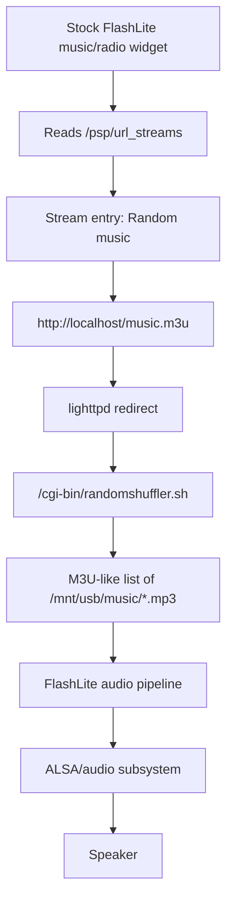
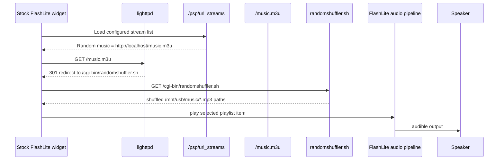

# FlashLite Audio Pipeline

Status: Sprint 13 reverse engineering notes for the proven stock audio path.

Sprint 13 investigates the only hardware-confirmed audible streaming path found so far: the stock Chumby radio/music widget requesting `/music.m3u`, which lighttpd redirects to `/cgi-bin/randomshuffler.sh`.

## Confirmed Evidence

| Evidence | Source |
| --- | --- |
| The stock radio/music widget produced audible audio through the speaker. | Hardware validation on Chumby `192.168.1.104`. |
| While audio was heard, lighttpd logged `GET /music.m3u` followed by `GET /cgi-bin/randomshuffler.sh`. | `/cgi-bin/logs.sh` output from 2026-08-13. |
| `/psp/url_streams` originally contained one stream entry named `Random music` with URL `http://localhost/music.m3u`. | USB inspection of `E:\psp\url_streams`. |
| lighttpd redirects `/music.m3u` to `/cgi-bin/randomshuffler.sh`. | USB inspection of `E:\lighty\lighttpd.conf`. |
| `randomshuffler.sh` outputs shuffled `/mnt/usb/music/*.mp3` paths. | USB inspection of `E:\lighty\cgi-bin\randomshuffler.sh`. |
| `player.sh` reads `/psp/url_streams` and renders stream controls. | USB inspection of `E:\lighty\cgi-bin\player.sh`. |
| `chum.js` sends `UserPlayer play` events for stream URLs selected in the web player UI. | USB inspection of `E:\lighty\html\chum.js`. |
| `zmote_play.sh` with a local MP3 emitted a `UserPlayer play` event and started FlashLite but produced no audio. | Hardware validation on Chumby `192.168.1.104`. |
| `custom/multistreams.sh?groovesalad` returned `Now playing groovesalad` but produced no audio. | Hardware validation on Chumby `192.168.1.104`. |
| TTS remains audible. | Hardware validation of `/cgi-bin/speak.pl`. |

## Architecture



## Sequence



## File Inventory

| File | Role | Evidence |
| --- | --- | --- |
| `/psp/url_streams` | Stream list consumed by the stock player UI/widget path. | Contains `<stream url="http://localhost/music.m3u" ... name="Random music" />` before Sprint 13 experiment. |
| `/psp/url_streams.sprint13-original` | USB backup of the pre-experiment stream list. | Created before replacing `/psp/url_streams`. |
| `/mnt/usb/lighty/lighttpd.conf` | HTTP routing and CGI configuration. | Contains `cgi.assign`, `/cgi-bin/` alias, and `/music.m3u` redirect to `/cgi-bin/randomshuffler.sh`. |
| `/mnt/usb/lighty/cgi-bin/randomshuffler.sh` | Generates the playlist for `/music.m3u`. | Script lists `/mnt/usb/music/*.mp3`, prefixes random numbers, sorts, and strips the prefixes. |
| `/mnt/usb/lighty/cgi-bin/player.sh` | Renders a web player UI and embeds `/psp/url_streams`. | Reads `streams_xml=cat /psp/url_streams`. |
| `/mnt/usb/lighty/cgi-bin/save_streams.sh` | Saves updated stream XML into `/psp/url_streams`. | Backs up `/psp/url_streams` and writes decoded `QUERY_STRING`. |
| `/mnt/usb/lighty/html/chum.js` | Browser-side helper for the web player UI. | Sends `UserPlayer play` events with selected stream URL. |
| `/mnt/usb/music/*.mp3` | Local MP3 library used by `randomshuffler.sh`. | USB contains multiple public-domain MP3 files plus test `sample.mp3`. |
| `/mnt/usb/controlpanel.swf` and `/mnt/usb/lighty/html/*player*.swf` | FlashLite runtime assets and stock music app assets. | Present on USB; exact SWF internals not yet inspected. |

## music.m3u Ownership

`/music.m3u` is not a static file on the USB root in the observed runtime. It is an HTTP route configured in lighttpd:

```text
^/music.m3u?(.*)$ => /cgi-bin/randomshuffler.sh$1
```

`randomshuffler.sh` generates the playlist at request time. There is no evidence yet that a static `/mnt/usb/music.m3u` file is generated at boot.

## randomshuffler.sh Behavior

Observed script:

```sh
#!/bin/sh
find /mnt/usb/music/*.mp3 | while read x; do echo "`expr $RANDOM % 10000`:$x"; done | sort -n| sed 's/[0-9]*://'
```

| Aspect | Observed behavior |
| --- | --- |
| Inputs | No explicit HTTP query input observed. Reads `/mnt/usb/music/*.mp3`. |
| Environment | Runs as lighttpd CGI via `.sh => /bin/sh`. |
| Output | Plain path list, one local MP3 path per line, in randomized order. |
| Programs | `find`, `expr`, `sort`, `sed`, shell loop. |
| Player launch | Does not launch a player. It only returns playlist content. FlashLite consumes the returned playlist. |

## Station Selection

The proven path begins with `/psp/url_streams`. Before the Sprint 13 experiment it contained:

```xml
<streams><stream url="http://localhost/music.m3u" id="" mimetype="audio/x-mpegurl" name="Random music" /></streams>
```

Selection appears to be:

1. Stock UI/widget exposes or selects the `Random music` stream entry.
2. FlashLite requests the entry URL, `http://localhost/music.m3u`.
3. lighttpd redirects the URL to `randomshuffler.sh`.
4. `randomshuffler.sh` returns a shuffled local MP3 playlist.
5. FlashLite plays at least one returned item audibly.

## Controlled Experiment

Sprint 13 temporarily replaced `/psp/url_streams` on the USB stick with exactly one station entry. The stream URL was updated during Sprint 13 after the earlier Omrop Fryslan endpoint stopped working:

```xml
<streams><stream url="https://d3pvma9xb2775h.cloudfront.net/icecast/omropfryslan/radio.mp3" id="" mimetype="audio/mpeg" name="Omrop Fryslan" /></streams>
```

Backup file:

```text
/psp/url_streams.sprint13-original
```

This is a USB-only configuration change. It does not modify internal flash, FlashLite, `btplayd`, or any playback engine.

## Experiment Validation

Pending hardware test after reboot with the USB inserted.

Expected test:

1. Boot to the original Chumby runtime.
2. Open the stock music/radio widget path that previously showed `Random music`.
3. Select or start the single configured stream, `Omrop Fryslan`.
4. Record whether audio is heard.
5. Capture `/cgi-bin/logs.sh` output.

Expected evidence if successful:

```text
GET /music_sources/show
GET /psp/url_streams or equivalent stream list path
GET /...OmropFryslanRadio.mp3 or stock player request evidence
```


## Known-Good Playlist Format

A hardware capture of `/music.m3u` returned bytes that decode to a plain ASCII playlist.

```yaml
entry_count: 27
format: plain LF-separated local paths
paths: /mnt/usb/music/*.mp3
header: none
metadata: none
remote_urls: none
```

Representative body:

```text
/mnt/usb/music/MIT_Concert_Choir_-_01_-_O_Fortuna.mp3
/mnt/usb/music/MIT_Concert_Choir_-_02_-_Fortune_planto_vulnera.mp3
/mnt/usb/music/MIT_Concert_Choir_-_03_-_Veris_leta_facies.mp3
...
/mnt/usb/music/apollo.mp3
/mnt/usb/music/hal.mp3
/mnt/usb/music/sample.mp3
```

The proven audio path therefore plays local file paths generated by `randomshuffler.sh`. The failed M3U wrapper used the same MIME family but not the same playlist content type, because it contained a remote HTTPS stream URL.
## M3U Wrapper Follow-up

Because the proven audible path used `audio/x-mpegurl`, the next controlled experiment should use a local playlist wrapper instead of a direct MP3 stream entry.

`/psp/url_streams`:

```xml
<streams><stream url="http://localhost/omrop-fryslan.m3u" id="" mimetype="audio/x-mpegurl" name="Omrop Fryslan" /></streams>
```

`/mnt/usb/lighty/html/omrop-fryslan.m3u`:

```text
https://d3pvma9xb2775h.cloudfront.net/icecast/omropfryslan/radio.mp3
```

Hardware result: this wrapper still produced no audio. This still reuses the stock FlashLite playback architecture and changes only USB configuration/static playlist data, but it is not sufficient for the tested HTTPS stream.
## Rollback

Restore the original USB stream list:

```powershell
Copy-Item E:\psp\url_streams.sprint13-original E:\psp\url_streams -Force
```


## Sample Local Playlist Result

A user-provided local playlist matching the known-good response format was tested through the Zurk/Chumote Play URL control:

```text
http://localhost/sample-local.m3u
```

Playlist body:

```text
/mnt/usb/music/sample.mp3
```

Result: no audio.

This means the working behavior is not simply "FlashLite can play any M3U containing local paths." The initiation path matters. The known audible case is the stock FlashLite music/radio widget using the built-in `Random music` stream entry and `/music.m3u` redirect.
## Browser Fetch Versus Playback

Fetching a playlist URL from a desktop browser is not the same as asking the Chumby FlashLite widget to play it.

Observed browser tests from `192.168.1.99`:

| URL | Result | Meaning |
| --- | --- | --- |
| `/cgi-bin/randomshuffler.sh` | Returned the local MP3 path list; no audio. | `randomshuffler.sh` is a playlist generator only. |
| `/cgi-bin/music.m3u` | Returned the local MP3 path list; no audio. | Playlist text was served, but no Chumby player was invoked. |
| `/sample-local.m3u` | HTTP 404. | The test playlist was not present at that web path. |
| `/omrop-fryslan.m3u` | HTTP 200 with a short response; no audio. | The playlist wrapper can be fetched, but desktop fetch does not validate Chumby playback. |

Use lighttpd user agent and source IP as evidence. The proven audible path used FlashLite-originated requests from `127.0.0.1` with a Flash Lite user agent. Browser-originated requests from the PC only validate HTTP serving.
## Captured Working Stock Player Session

A later Sprint 13 capture confirmed the stock music player path with audible output.

```yaml
date: 2026-08-14
ui_path: Stock Music Player -> My Streams -> Random music
visible_status: Now Playing: Random music
audio: heard through speaker
startup_delay: noticeable
volume_initially_responsive: false
volume_later_responsive: true
```

Evidence files captured from the real device session:

| File | Finding |
| --- | --- |
| `C:\Users\Surface\Desktop\chumby-playing-fb1.jpg` | Framebuffer 1 shows the stock `My Streams` player, `Now Playing: Random music`, playback controls, and volume slider. |
| `C:\Users\Surface\Desktop\chumby-playing-fb0.jpg` | Framebuffer 0 shows the normal stock widget layer, confirming the original UI remained active. |
| `C:\Users\Surface\Desktop\chumby-playing-top.txt` | `chumbyflashplay`, `btplayd`, and `lighttpd` were running while audio was heard. |
| `C:\Users\Surface\Desktop\chumby-playing-music-m3u.txt` | `/music.m3u` contained 27 LF-separated local MP3 paths under `/mnt/usb/music`. |
| `C:\Users\Surface\Desktop\chumby-playing-logs.txt` | The web server was active and serving framebuffer/log diagnostic requests during the session. |

Key process evidence while audio was playing:

```text
chumbyflashplay: active, high CPU
btplayd: active
lighttpd: active
```

The confirmed playback action was performed through the physical stock UI. That is materially different from fetching playlist URLs from a desktop browser or using the Zork/Chumote Play URL field, both of which previously returned successful HTTP responses without audible playback.
## Open Questions

| Question | Next evidence needed |
| --- | --- |
| Which exact SWF owns the audible stock widget playback? | Capture active FlashLite asset/state or inspect SWFs if practical. |
| Does the stock widget play direct MP3 stream URLs from `/psp/url_streams`? | Answer: no for the tested CloudFront `https` MP3. The station appears but does not play. |
| Does the stock widget require `audio/x-mpegurl` playlists rather than direct `audio/mpeg` streams? | Matching the local-path playlist format through Zurk/Chumote Play URL still failed. The exact stock widget selection path remains the important difference. |
| Why do direct `UserPlayer` events from `zmote_play.sh`, `multistreams.sh`, and Zurk/Chumote Play URL stay silent? | Compare generated events/logs with the stock FlashLite widget selecting `Random music`. |
| What event does the stock `My Streams` Play button send? | Capture FlashLite events or filesystem side effects while pressing Play in the stock UI. |
| Can the stock `Random music` entry be triggered externally without the Zork Play URL path? | Compare the physical UI path with `/tmp/flashplayer.event`, `control.cgi`, and any player state files during playback. |
| What playlist entries did the audible random music session actually play? | Answer: 27 LF-separated `/mnt/usb/music/*.mp3` paths, with no header or metadata. |
