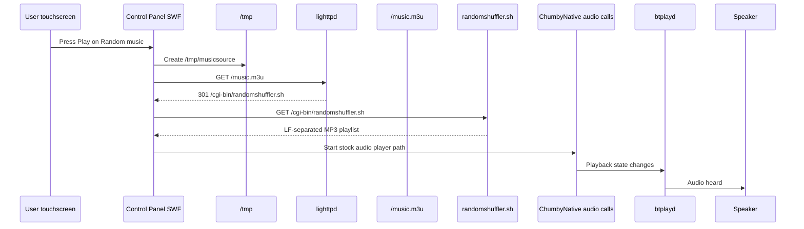

# FlashLite Playback Trigger

Status: Sprint 15 reverse engineering notes.

This document focuses only on the proven stock playback path:

```text
Music Player -> My Streams -> Random music -> Play
```

The goal is to identify the minimum external action that can reproduce the stock Play button without modifying FlashLite, recompiling the Control Panel SWF, replacing `btplayd`, or creating a new playback engine.

## Confirmed Playback Path



## Evidence Sources

| Evidence | Source |
| --- | --- |
| Stock Music Player produces audible audio. | Hardware testing using `Music Player -> My Streams -> Random music -> Play`. |
| `/tmp/musicsource` is absent before Play. | `E:\ha-chumby\music-player-before-stock-play.txt`, 2026-08-24 19:56:32. |
| `/tmp/musicsource` appears while playing. | `E:\ha-chumby\music-player-stock-playing.txt`, 2026-08-24 19:58:33. |
| `/tmp/musicsource` is absent after stock Stop. | `E:\ha-chumby\music-player-stock-stopped.txt`, 2026-08-24 19:59:40. |
| `btplayd` PID remains stable through Play and Stop. | PID `1476` in all 2026-08-24 stock music snapshots. |
| FlashLite requests `/music.m3u` and follows the redirect to `randomshuffler.sh`. | lighttpd access log lines in `music-player-stock-playing.txt`. |
| The active Control Panel SWF contains Direct URL player code. | Offline decompressed SWF search in `D:\GitHub\ha-chumby\controlpanel-search-results.txt`. |
| Sprint 15 diagnostics reproduced the lifecycle with extra Flash command pipe evidence. | `E:\ha-chumby\music-player-sprint15-before-play.txt`, `music-player-sprint15-playing.txt`, and `music-player-sprint15-stopped.txt`, 2026-08-24 20:49-20:52. |

The generated SWF analysis files are reverse-engineering artifacts and should not be committed unless a later sprint sanitizes them:

```text
D:\GitHub\ha-chumby\controlpanel.decompressed.swf
D:\GitHub\ha-chumby\controlpanel-search-results.txt
```

## `/tmp/musicsource` Lifecycle

Observed playing content:

```xml
<musicSource state="&lt;stream url=&quot;http://localhost/music.m3u&quot; id=&quot;&quot; mimetype=&quot;audio/x-mpegurl&quot; name=&quot;Random music&quot; /&gt;" label="Random music" selector="directurl" />
```

Lifecycle observed on 2026-08-24:

| State | `/tmp/musicsource` | Evidence |
| --- | --- | --- |
| Before stock Play | absent | `music-player-before-stock-play.txt` |
| While stock playback is active | present, 209 bytes | `music-player-stock-playing.txt` and `musicsource-stock-playing.xml` |
| After stock Stop | absent | `music-player-stock-stopped.txt`; `musicsource-stock-stopped.xml` is zero bytes |

Lifecycle reproduced by Sprint 15 diagnostics on 2026-08-24:

| State | Time | `/tmp/musicsource` | `btplayd` PID | Evidence |
| --- | --- | --- | --- | --- |
| Before stock Play | 20:49:53 | absent | `1464` | `music-player-sprint15-before-play.txt` |
| While stock playback is active | 20:51:51 | present, 209 bytes | `1464` | `music-player-sprint15-playing.txt` |
| After stock Stop | 20:52:29 | absent | `1464` | `music-player-sprint15-stopped.txt` |

Interpretation from evidence:

- The Control Panel SWF is the likely writer because the file appears only after the touchscreen Play action and matches SWF Direct URL state.
- `/tmp/musicsource` records active source state.
- `/tmp/musicsource` is not proven to be a trigger.
- Writing this file manually is not yet supported by evidence.

## ActionScript Ownership

Offline SWF search found the following relevant symbols:

```text
DirectURLStreams.loadStreams()
/psp/url_streams
DirectURLPlayer.playStream()
DirectURLPlayer.playStream(): M3U
playM3U
DirectURLPlayer.gotM3U()
DirectURLPlayer.playURL()
DirectURLPlayer.doStartTrack()
DirectURLPlayer.doStopTrack()
DirectURLPanelMain.doPlay()
ExternalMusicCallbacks.setMusicSource
```

Interpretation:

- `DirectURLPanelMain.doPlay()` is the closest observed symbol to the stock My Streams Play button.
- `DirectURLPlayer.playStream()` appears to own source playback after the UI action.
- M3U parsing is inside the Control Panel SWF.
- `/psp/url_streams` supplies the `http://localhost/music.m3u` input.
- The literal strings `music.m3u` and `randomshuffler` were not found in the SWF because they are runtime data and HTTP redirect behavior, not embedded trigger strings.

## IPC Findings

Observed FlashLite command-related files:

```text
/tmp/.fpcmdsend
/tmp/.fpcmdrecv
```

Observed process:

```text
chumbpipe /tmp/.fpcmdsend /tmp/.fpcmdrecv
```

Known file descriptor direction from Sprint 14:

```text
/proc/<chumbpipe>/fd/4 -> /tmp/.fpcmdsend  read-only
/proc/<chumbpipe>/fd/5 -> /tmp/.fpcmdrecv  write-only
```

Interpretation:

- These FIFOs are plausible FlashLite command transport.
- The protocol is unknown.
- Blind writes are not allowed because they can block or destabilize the Control Panel.
- The decompressed SWF search did not reveal `fpcmd` or `chumbpipe` command strings.

Sprint 15 snapshots observed the FIFOs in all three states:

| Snapshot | `/tmp/.fpcmdsend` timestamp | `/tmp/.fpcmdrecv` timestamp |
| --- | --- | --- |
| `sprint15-before-play` | 20:32 | 20:32 |
| `sprint15-playing` | 20:50 | 20:50 |
| `sprint15-stopped` | 20:52 | 20:52 |

This is useful but not yet conclusive. The timestamp changes show the FIFO nodes are active or refreshed during the stock player lifecycle, but the snapshots do not capture message contents or prove the external command protocol.

## Rejected Triggers

| Candidate | Status | Evidence |
| --- | --- | --- |
| Desktop/browser request to `/music.m3u` | Rejected | Returns playlist data but does not start audio. |
| `randomshuffler.sh` as the player | Rejected | It returns playlist text; no player launch is observed. |
| `control.cgi?radio1` as equivalent path | Rejected | Reaches `btplayd` but does not reproduce reliable stock playback. |
| Manual `/tmp/flashplayer.event` with `UserPlayer play` | Rejected for tested input | Event file persisted; no new FlashLite `/music.m3u` request and no `/tmp/musicsource`. |
| Blind FIFO writes to `/tmp/.fpcmdsend` | Not attempted | Protocol unknown and unsafe. |

## Controlled Experiment Plan

Only evidence-backed experiments are allowed. The safest next experiment is observational:

1. Capture a snapshot before Play.
2. Press stock Play on the touchscreen.
3. Capture a snapshot while audio is heard.
4. Press stock Stop on the touchscreen.
5. Capture a stopped snapshot.

Sprint 15 diagnostics extend `music-player-snapshot.sh` to include:

- `/tmp/.fpcmdsend`
- `/tmp/.fpcmdrecv`
- `/tmp/flashheartbeat`
- `/tmp/movieheartbeat`
- `/tmp/flashplayer_started`
- focused `chumbyflashplayer`, `btplayd`, `chumbpipe`, and `start_control_panel` process lines

These additions are read-only diagnostics.

## Proof-of-Concept Status

No proof-of-concept is included yet.

Reason: no external trigger has been identified with enough evidence. The closest known Play trigger is `DirectURLPanelMain.doPlay()` inside the active Control Panel SWF, and invoking that ActionScript function externally has not been proven possible without using an unknown IPC protocol or modifying FlashLite/SWF behavior.

## Current Conclusion

The original playback path is owned by the FlashLite Control Panel application. `music.m3u` is input data, `/tmp/musicsource` is active source state, and `btplayd` is the stable playback daemon. The missing piece is an externally callable, stock-supported way to ask the Control Panel SWF to execute its existing `DirectURLPanelMain.doPlay()` path.

## Remaining Unknowns

| Question | Current answer |
| --- | --- |
| What exactly does `DirectURLPanelMain.doPlay()` initiate? | It likely calls internal Direct URL player logic, but the exact bytecode path has not been decompiled. |
| How is `DirectURLPlayer.playStream()` reached? | Static SWF symbols show the method exists; hardware evidence shows the UI path reaches M3U playback. Exact call chain remains unknown. |
| Who creates `/tmp/musicsource`? | Most likely the Control Panel SWF via FlashLite native file APIs; direct writer not yet observed. |
| What happens if `/tmp/musicsource` already exists? | Unknown. Do not test by manual writes until the file is proven to be command input. |
| Can the path be triggered programmatically? | Not yet proven. |
