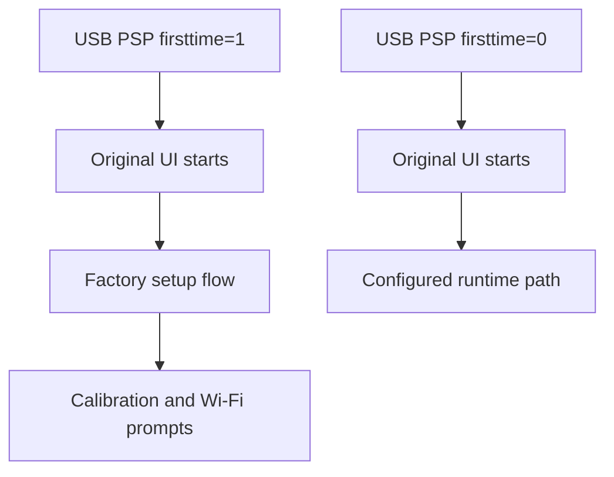

# PSP Configuration

Status: Sprint 11 USB PSP configuration state reference.

Real hardware showed that the USB stick is mounted over `/psp` during boot. That means the original Chumby runtime reads PSP state from the USB stick, not from the internal PSP partition. Sprint 11 changes only the USB first-run marker and preserves the rest of Zurk's USB PSP content. Hardware validation must confirm whether this is sufficient to avoid the factory setup flow.

## Evidence

| Evidence | Source |
| --- | --- |
| USB is mounted at `/mnt/usb` and also over `/psp`. | `/mnt/usb/ha-chumby/boot-diagnostics.txt` from Sprint 10 hardware validation. |
| The original UI starts after Sprint 10 hand-off. | Hardware validation. |
| The UI enters touchscreen calibration and Wi-Fi setup. | Hardware validation. |
| USB `/psp/firsttime` contains `1`. | USB filesystem inspection on `E:\psp\firsttime`. |
| USB `/psp/ts_settings` exists. | USB filesystem inspection on `E:\psp\ts_settings`. |
| USB `/psp/network_config` exists. | USB filesystem inspection on `E:\psp\network_config`. |

## Restored Configuration

The smallest evidence-based Sprint 11 change is USB-only:

```text
/psp/firsttime = 0
```

The installer preserves the original Zurk value as:

```text
/psp/firsttime.zurk-original
```

No internal flash is modified. The existing `ts_settings` and `network_config` files are preserved because they already exist on the USB PSP tree. Sprint 11 does not invent calibration or Wi-Fi values.

## PSP Directory Layout

| Path | Category | Observed purpose or evidence | Sprint 11 action |
| --- | --- | --- | --- |
| `firsttime` | boot state | Contains `1` on the USB while hardware enters factory setup. Treated as the first-run state candidate pending validation with value `0`. | Set to `0` on USB; back up original value. |
| `firsttime.zurk-original` | boot state backup | Created by HA-Chumby installer before changing `firsttime`. | Preserve. |
| `ts_settings` | touchscreen calibration | Chumby Wiki documents `ts_settings` as touchscreen calibration data; file exists on USB. | Preserve. |
| `network_config` | network | XML network configuration; file exists on USB. | Preserve. |
| `network_config_bak` | network | Backup XML network configuration. | Preserve. |
| `network_config_off` | network | Static/offline XML network configuration. | Preserve. |
| `net_adapters/` | network | Network adapter state directory. | Preserve. |
| `hostname` | network | Hostname value. | Preserve. |
| `hosts`, `hosts.offline`, `hosts.pandora` | network/runtime | Host mapping files used by Zurk offline/Pandora modes. | Preserve. |
| `httpd.conf` | runtime configuration | BusyBox `httpd` MIME/config file used before Zurk lighttpd restoration. | Preserve. |
| `flashplayer.cfg` | runtime configuration | Flash player configuration. | Preserve. |
| `disable_intro` | runtime configuration | Zero-length marker file observed on USB; exact runtime effect not verified. | Preserve. |
| `volume`, `mute`, `pan` | runtime configuration | Audio state values. | Preserve. |
| `dimlevel`, `daymode_brightness`, `nightmode_brightness` | runtime configuration | Display brightness/night mode state. | Preserve. |
| `alarms`, `alarm2cron/`, `crontabs/` | runtime configuration | Alarm and scheduled task state. | Preserve. |
| `url_streams` | runtime configuration | Stream URL list used by Zurk player UI. | Preserve. |
| `clock_format`, `clockoverlay.xml`, `timezone`, `timezone_city`, `localtime`, `ntp.conf`, `use_ntp`, `ifdate.xml` | runtime configuration | Time, clock, and NTP state. | Preserve. |
| `asound.conf`, `asound.conf.internal`, `asound.conf.multi`, `asound.conf.usb` | runtime configuration | ALSA/audio configuration variants. | Preserve. |
| `fmradiostation` | runtime configuration | FM radio station state. | Preserve. |
| `zwapi.sh`, `zwapi.class` | widgets | Weather/API support files observed on USB; exact runtime role not verified in Sprint 11. | Preserve. |
| `udev/`, `usr/` | runtime configuration | Runtime support directories from Zurk USB PSP tree. | Preserve. |

## Boot State Transition



## Diagnostics

`installer/overlay/ha-chumby/start.sh` now logs:

- `/psp` mount state
- `/psp` and `/mnt/usb/psp` directory listings
- key PSP files and contents
- detected `firsttime` value
- whether touchscreen calibration and network configuration files exist

The diagnostics are written to:

```text
/tmp/ha-chumby.log
/mnt/usb/ha-chumby/boot-diagnostics.txt
```

## Remaining Unknowns

| Unknown | Next evidence needed |
| --- | --- |
| Whether `firsttime=0` alone fully bypasses setup on every Chumby Classic state. | Hardware validation after applying Sprint 11 USB state. |
| Whether the placeholder SSID in `network_config` is acceptable once `firsttime=0`. | Hardware validation with DHCP/network already observed working. |
| Whether the original internal PSP contains better personalized state that should be copied to USB. | Only investigate if `firsttime=0` does not restore normal UI. |
| Whether first-run state has additional files beyond `firsttime`. | Compare logs before and after hardware validation. |

## Rollback

Rollback is USB-only:

1. Power off the Chumby.
2. Remove the USB stick.
3. Restore `/psp/firsttime` from `/psp/firsttime.zurk-original` on the USB stick.
4. Boot again.

Removing the USB stick still restores the original internal firmware behavior because HA-Chumby does not modify internal flash.
