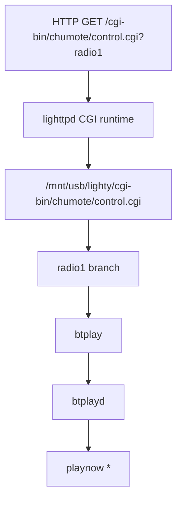

# Radio Presets

Status: Sprint 12 radio preset modernization reference.

Sprint 12 keeps the original Chumote playback path. The radio button still calls `control.cgi?radio1`, `control.cgi` still talks to `btplayd`, and `btplayd` still performs playback. The only intended change is replacing the obsolete `radio1` stream URL.

## Confirmed Runtime Behavior

| Item | Evidence | Source |
| --- | --- | --- |
| `control.cgi?radio1` reaches `btplayd`. | Hardware output includes `Connected to btplayd`. | Hardware validation on Chumby `192.168.1.104`. |
| `radio1` resolves to a `playnow` request. | Hardware output includes `OK 101 playnow 0` and `playnow * http://66.162.107.142/cpr1_lo`. | Hardware validation on Chumby `192.168.1.104`. |
| The legacy CPR stream URL is obsolete for this MVP. | The requested old URL returns HTTP 404 during hardware validation. | Hardware validation. |
| Earlier firmware inventory located the `radio1`, `radio2`, and `radio3` mappings in `control.cgi`. | `docs/API.md` lists `control.cgi?radio1` as running `btplay http://66.162.107.142/cpr1_lo`. | `docs/API.md`. |
| A modern Omrop Fryslan MP3 stream URL is available. | Stream listings include `https://d3pvma9xb2775h.cloudfront.net/icecast/omropfryslan/radio.mp3`. | [DELUUXE streamlinks](https://deluuxe.dev/streamlinks), [Spotlist regionale omroepen](https://www.spotlist.store/regio.html). |
| Patched `radio1` resolves to the Omrop Fryslan URL. | Hardware output includes `playnow * https://d3pvma9xb2775h.cloudfront.net/icecast/omropfryslan/radio.mp3`. | Hardware validation on Chumby `192.168.1.104`. |
| Patched `radio1` does not produce audible playback. | Hardware validation produced no audio and later showed `btplayd` becoming unresponsive after the stream request. | Hardware validation on Chumby `192.168.1.104`. |
| The custom Flash/UserPlayer stream path executes but is also silent. | `/cgi-bin/custom/multistreams.sh?groovesalad` returned `Now playing groovesalad`, but no audio was heard. | Hardware validation on Chumby `192.168.1.104`. |
| General audio output still works. | TTS through `/cgi-bin/speak.pl` remains audible. | Hardware validation on Chumby `192.168.1.104`. |
| The stock radio widget can play at least one random radio stream. | User selected random radio through the Chumby radio widget and heard audio; logs show `GET /music.m3u` followed by `GET /cgi-bin/randomshuffler.sh`. | Hardware validation on Chumby `192.168.1.104`. |
| A local MP3 through `zmote_play.sh` does not play. | The endpoint emitted a `UserPlayer play` event for `file:///mnt/usb/music/sample.mp3` and started FlashLite, but no audio was heard. | Hardware validation on Chumby `192.168.1.104`. |

## Lookup Chain



## Preset Location

| Preset | Current evidence | Sprint 12 action |
| --- | --- | --- |
| `radio1` | Hardware output and `docs/API.md` show the URL is resolved by `control.cgi`. No separate preset database has been proven yet. | Patch only the legacy `radio1` URL in `control.cgi` during USB preparation, preserving a backup. |
| `radio2` | Earlier inventory shows `control.cgi` maps it to `http://66.162.107.142/cpr3_lo`. | Leave unchanged. |
| `radio3` | Earlier inventory shows `control.cgi` maps it to `http://66.162.107.142/cpr2_lo`. | Leave unchanged. |

## Updated Radio 1 URL

```text
https://d3pvma9xb2775h.cloudfront.net/icecast/omropfryslan/radio.mp3
```

The installer backs up the original file before patching:

```text
/mnt/usb/lighty/cgi-bin/chumote/control.cgi.zurk-original
```

Only this exact legacy URL is replaced:

```text
http://66.162.107.142/cpr1_lo
```


## Playback Validation Status

Sprint 12 modernized preset lookup but did not achieve audible radio playback.

| Playback path | Result | Interpretation |
| --- | --- | --- |
| `control.cgi?radio1` -> `btplay` -> `btplayd` | Resolves patched URL, then no audio; repeat attempts can wedge `btplayd`. | Preset lookup is fixed; `btplayd` stream playback needs separate diagnostics. |
| `custom/multistreams.sh?groovesalad` -> Flash `UserPlayer` event | Script executes and returns `Now playing groovesalad`, but no audio. | Stream playback is not working through the Flash/UserPlayer event path either. |
| `speak.pl` TTS | Audible. | Audio hardware and mixer are not globally broken. |
| Stock radio widget random stream | Audible. | The stock widget has a working `/music.m3u` -> `randomshuffler.sh` playback path that Sprint 13 should discover and reuse. |
| `zmote_play.sh?file:///mnt/usb/music/sample.mp3` | Emits `UserPlayer play` and starts FlashLite, but silent. | The failure is not network-stream-only. |

Do not treat radio silence as a preset database failure. The next investigation belongs to audio/player diagnostics.
## Update Procedure

For a newly prepared USB stick, run the normal preparation script. If `lighty/cgi-bin/chumote/control.cgi` exists and contains the legacy `radio1` URL, the installer replaces only that URL and records the change in `HA-CHUMBY-MANIFEST.txt`.

For an already prepared USB stick, update only the existing USB file after confirming it contains the legacy URL:

```powershell
$control = "E:\lighty\cgi-bin\chumote\control.cgi"
$backup = "E:\lighty\cgi-bin\chumote\control.cgi.zurk-original"
$old = "http://66.162.107.142/cpr1_lo"
$new = "https://d3pvma9xb2775h.cloudfront.net/icecast/omropfryslan/radio.mp3"

if (-not (Test-Path $backup)) {
    Copy-Item $control $backup -Force
}

$text = [System.IO.File]::ReadAllText($control)
if ($text.Contains($old)) {
    [System.IO.File]::WriteAllText($control, $text.Replace($old, $new), [System.Text.Encoding]::ASCII)
}
```

## Adding New Stations

Do not add new stations by creating a replacement player. First locate whether the target preset is stored in `control.cgi`, `/psp/url_streams`, or another Zurk configuration file. Prefer changing data files over script edits. If the preset is hardcoded, patch only the exact URL and preserve the original file.

## Restoring Defaults

Rollback is USB-only:

```powershell
Copy-Item E:\lighty\cgi-bin\chumote\control.cgi.zurk-original E:\lighty\cgi-bin\chumote\control.cgi -Force
```

Removing the USB stick still restores the internal firmware behavior because HA-Chumby does not modify internal flash.


## Working Stock Radio Path

Hardware validation found one audible streaming path in the stock radio widget. The web log shows FlashLite requested `/music.m3u`, then followed a redirect to `/cgi-bin/randomshuffler.sh`:

```text
GET /music.m3u HTTP/1.1
GET /cgi-bin/randomshuffler.sh HTTP/1.1
```

This path is now the preferred evidence target. Sprint 13 should inspect the script and the playlist payload before changing any more radio endpoints.
## Open Questions

| Question | Next evidence needed |
| --- | --- |
| Is there a separate Zurk radio preset database outside `control.cgi` on the full USB image? | Run Sprint 12 radio diagnostics on hardware with the full USB stick mounted. |
| Does the Chumby build of `btplayd` support the Omrop Fryslan MP3 stream reliably? | Current evidence says no: repeat attempts can wedge `btplayd`; verify only after Sprint 13 player diagnostics. |
| Are `radio2` and `radio3` still useful? | Hardware validation if those presets matter for the MVP. |
| Which URL and event path does the audible stock radio widget use? | Inspect `/music.m3u`, `/cgi-bin/randomshuffler.sh`, and the playlist response captured while random radio is playing. |
