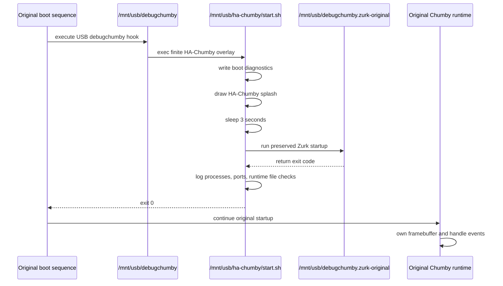

# Runtime Restoration

Status: Sprint 10 restored-runtime design and implementation note.

Real hardware proved that keeping HA-Chumby in a permanent foreground redraw loop restores web services but prevents the original Chumby UI and widget engine from taking over the framebuffer. Sprint 10 changes the overlay from a runtime replacement into a short boot marker followed by a hand-off back to the original Chumby startup sequence.

## Startup Chain

## Original Runtime

The original runtime is the stock Chumby UI path that continues after the USB `debugchumby` hook returns. Earlier hardware testing showed that when HA-Chumby exits, the stock setup/calibration flow resumes. Sprint 10 intentionally uses that behavior instead of blocking it.

The original Zurk startup remains responsible for the Zurk web services. The preserved `/mnt/usb/debugchumby.zurk-original` script starts lighttpd and supporting pieces from the USB stick. HA-Chumby does not recreate that logic.

## Boot Overlay

The HA-Chumby overlay now performs only these actions:

1. create `/tmp/ha-chumby.log`
2. copy diagnostics to `/mnt/usb/ha-chumby/boot-diagnostics.txt`
3. write the HA-Chumby splash image to the framebuffer
4. wait approximately 3 seconds
5. run the preserved Zurk startup script when present
6. log final process and runtime checks
7. exit with status 0 so the original boot sequence can continue

The overlay no longer keeps a foreground redraw loop alive.

## Control Hand-Off

The hand-off is simple: `start.sh` exits. Because `/mnt/usb/debugchumby` uses `exec sh /mnt/usb/ha-chumby/start.sh`, the USB startup hook process ends when `start.sh` exits. Control then returns to the original boot code that invoked `debugchumby`.

This is intentionally less invasive than keeping a custom process in the foreground.

## Process Ownership

| Resource | Expected owner after hand-off |
| --- | --- |
| Framebuffer | Original Chumby UI/widget engine |
| Chumote events | Original Chumby runtime and Flash/event handlers |
| Zurk HTTP service | Zurk lighttpd startup from `/mnt/usb/debugchumby.zurk-original` |
| HA-Chumby | No long-running process in Sprint 10 |

The diagnostics attempt to identify framebuffer ownership by scanning `/proc/*/fd` for `/dev/fb` references. That may not work on all Chumby builds, so the visible UI is the primary hardware proof.

## Rationale

This approach is the smallest change that matches the measured hardware behavior:

- It preserves the USB boot hook.
- It keeps the HA-Chumby splash as a visible proof of boot.
- It restores Zurk's own startup script instead of reimplementing it.
- It exits instead of replacing the original runtime.
- It lets the stock UI/widget engine handle framebuffer and Chumote events.

## Validation

Manual validation after copying the new overlay to USB:

| Step | Expected result |
| --- | --- |
| Power on with USB inserted | HA-Chumby splash appears. |
| Wait a few seconds | Original Chumby interface appears automatically. |
| Wait for runtime startup | Widgets become active. |
| Open Chumote web interface | Existing CGI pages respond. |
| Call `event.cgi?wake` | Device wake/night state changes visibly. |
| Call `event.cgi?setVolume100` | Volume changes. |
| Start radio playback | Audio plays through original runtime. |
| Remove USB and reboot | Device returns to previous non-HA-Chumby behavior. |

## Known Limitations

- Sprint 10 does not implement Home Assistant changes.
- Sprint 10 does not add alarms or custom runtime services.
- The splash duration is intentionally fixed at 3 seconds.
- If the original Zurk startup speaks welcome messages, Sprint 10 preserves that behavior.
- If the original Chumby UI still does not appear after `start.sh` exits, the next diagnostic target is the caller that invokes `/mnt/usb/debugchumby`.
