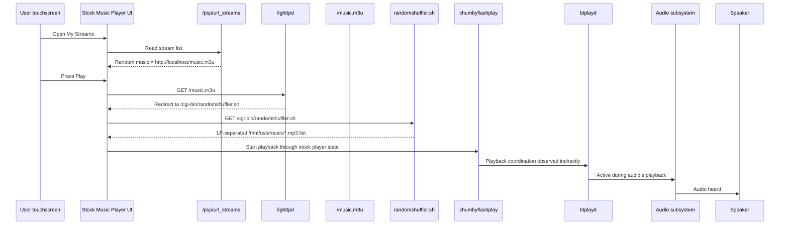
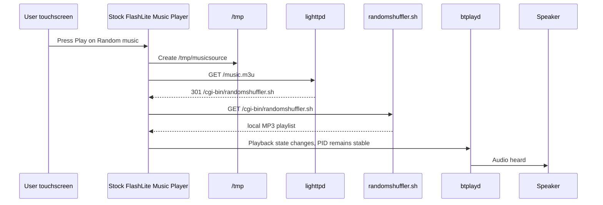

# Stock Music Player Control

Status: Sprint 14 reverse engineering plan and current evidence.

Sprint 14 investigates the only playback path that has produced repeatable audible audio on the real Chumby Classic:

```text
Music Player -> My Streams -> Random music -> Play
```

The objective is to discover and reuse the original trigger used by the stock player. This document does not define a replacement player, replacement CGI endpoint, or Home Assistant integration.

## Confirmed Facts

| Fact | Evidence |
| --- | --- |
| The stock Music Player can produce audible audio. | Hardware validation on Chumby `192.168.1.104` on 2026-08-14. |
| The working user path is `Music Player -> My Streams -> Random music -> Play`. | User hardware report and framebuffer capture `C:\Users\Surface\Desktop\chumby-playing-fb1.jpg`. |
| Framebuffer 1 shows `Now Playing: Random music`. | `C:\Users\Surface\Desktop\chumby-playing-fb1.jpg`. |
| The original widget/runtime remains active while the music player overlay is visible. | `C:\Users\Surface\Desktop\chumby-playing-fb0.jpg` shows a stock AccuWeather widget. |
| `chumbyflashplay`, `btplayd`, and `lighttpd` are running while audio is heard. | `C:\Users\Surface\Desktop\chumby-playing-top.txt`. |
| `/music.m3u` returns a plain list of local MP3 files under `/mnt/usb/music`. | `C:\Users\Surface\Desktop\chumby-playing-music-m3u.txt`. |
| `control.cgi?radio1` can interrupt current playback, but does not produce the desired new stream playback. | Hardware validation during Sprint 12 and Sprint 14 context. |
| Direct URL playback paths do not match the working stock UI path. | Sprint 13 hardware tests of `zmote_play.sh`, `multistreams.sh`, Play URL, direct stream entries, and playlist wrappers. |

## Current Working Sequence



The final internal trigger between the stock UI and the playback components is not yet proven. The sequence above marks the uncertain segment as stock player state rather than inventing an API.

## Components Involved

| Component | Observed role | Evidence |
| --- | --- | --- |
| `/psp/url_streams` | Contains the `Random music` stream definition used by the stock player. | USB/runtime inspection from Sprint 13. |
| `/music.m3u` | Public local HTTP route used by the stock player. | lighttpd logs and captured response. |
| `/cgi-bin/randomshuffler.sh` | Generates the playlist response at request time. | Script inspection and `/music.m3u` response. |
| `chumbyflashplay` | Stock FlashLite runtime and likely UI/player owner. | Active with high CPU while audio is heard. |
| `btplayd` | Audio daemon active while playback is heard. | `top` capture during playback. |
| `lighttpd` | Serves `/music.m3u` and CGI scripts. | Active process and logs. |
| `/tmp/flashplayer.event` | Possible event handoff file. | Used by known scripts; not yet proven as the stock Play-button mechanism. |

## What Is Not Proven

| Hypothesis | Status | Reason |
| --- | --- | --- |
| Any HTTP fetch of `/music.m3u` starts playback. | Rejected. | Browser/PowerShell fetches return playlist text but do not produce audio. |
| `randomshuffler.sh` starts audio. | Rejected. | The script only emits playlist paths; no player launch is observed in the script. |
| `control.cgi?radio1` is equivalent to stock Play. | Rejected. | It interrupts playback and talks to `btplayd`, but does not produce the working result. |
| Direct `UserPlayer` events are sufficient. | Rejected for tested paths. | `zmote_play.sh` and related tests start FlashLite or return success but remain silent. |
| The stock Play button writes `/tmp/flashplayer.event`. | Not observed. | Lightweight snapshots did not capture `/tmp/flashplayer.event`; `/tmp/musicsource` is the stronger evidence target. |
| The stock Play button communicates through a socket or FIFO. | Unknown. | Full file-descriptor capture was too disruptive on hardware; use lightweight process and log snapshots first. |

## Sprint 14 Diagnostics

Sprint 14 uses manual snapshot diagnostics. Automatic boot-time stock music trigger probing was removed after hardware showed the Zork interface did not load reliably with those probes enabled.

### Manual Snapshot Diagnostics

Sprint 14 adds:

```text
/mnt/usb/ha-chumby/music-player-snapshot.sh
```

This lightweight helper captures a timestamped snapshot to:

```text
/mnt/usb/ha-chumby/music-player-<label>.txt
```

It does not start or stop playback. It only observes a small set of runtime state because the earlier full snapshot made the Chumby stop responding during hardware testing. Hardware validation confirmed the lightweight helper completed `before-play`, `selected`, `after-play`, and `playing` snapshots without freezing the device.

## Runtime Prerequisite

Before running any manual stock music snapshots, verify that the restored Zurk runtime is healthy.

Known-good evidence from 2026-08-14:

```text
ps: /mnt/usb/lighty/sbin/lighttpd -f /mnt/usb/lighty/lighttpd.conf
netstat: 0.0.0.0:80 LISTEN
http://192.168.1.104/ -> 200
http://192.168.1.104/cgi-bin/logs.sh -> 200
http://192.168.1.104/cgi-bin/chumote/index.cgi -> 200
http://localhost/music.m3u -> 301 to /cgi-bin/randomshuffler.sh -> 200
```

Do not run `music-player-snapshot.sh` until this runtime is healthy. The snapshot is intended to compare music player state, not diagnose early web-runtime startup failures.
## Hardware Test Procedure

Use this sequence on the real Chumby after booting normally into the stock UI.

1. Enable SSH from the Zork/Chumote page if needed.
2. SSH into the Chumby.
3. Capture the idle state:

```sh
sh /mnt/usb/ha-chumby/music-player-snapshot.sh before-play
```

4. On the Chumby touchscreen, open:

```text
Music Player -> My Streams -> Random music
```

5. Capture the selected-but-not-playing state if practical:

```sh
sh /mnt/usb/ha-chumby/music-player-snapshot.sh selected
```

6. Press `Play` on the touchscreen.
7. Immediately capture the first transition:

```sh
sh /mnt/usb/ha-chumby/music-player-snapshot.sh after-play-0s
```

8. Wait until audio is heard.
9. Capture the stable playing state:

```sh
sh /mnt/usb/ha-chumby/music-player-snapshot.sh playing
```

10. Use the stock UI or Chumote page to stop playback.
11. Capture the stopped state:

```sh
sh /mnt/usb/ha-chumby/music-player-snapshot.sh after-stop
```

12. Power off, mount the USB stick on the PC, and collect:

```text
E:\ha-chumby\music-player-before-play.txt
E:\ha-chumby\music-player-selected.txt
E:\ha-chumby\music-player-after-play-0s.txt
E:\ha-chumby\music-player-playing.txt
E:\ha-chumby\music-player-after-stop.txt
E:\ha-chumby\boot-diagnostics.txt
```

## Comparison Targets

When comparing snapshots, look for changes in:

- new or modified `/tmp/*event*` files
- `/tmp/flashplayer.event` contents
- new sockets or FIFOs
- `btplayd` process ID changes
- `chumbyflashplay` process ID changes
- file descriptors opened by `chumbyflashplay`
- file descriptors opened by `btplayd`
- new requests in lighttpd logs
- playlist request timing for `/music.m3u` and `/cgi-bin/randomshuffler.sh`

## Observed Play Transition

The lightweight snapshots captured the first concrete stock Play-button state transition.



Evidence from the 2026-08-14 snapshots:

| Observation | Evidence |
| --- | --- |
| Selecting `Random music` alone did not start playback. | `selected` snapshot had no `/tmp/musicsource` and no new music log lines. |
| Pressing Play created `/tmp/musicsource`. | `after-play` snapshot lists `/tmp/musicsource`, timestamp `14:08`, size `209`. |
| FlashLite requested the playlist. | access log shows `127.0.0.1 localhost` with Flash Lite user agent requesting `/music.m3u`. |
| lighttpd invoked `randomshuffler.sh`. | access log shows `/music.m3u` redirect followed by `GET /cgi-bin/randomshuffler.sh`. |
| `btplayd` was not restarted. | PID stayed `1434` from `before-play` through `playing`. |
| `/tmp/flashplayer.event` was not captured. | Lightweight snapshots did not find the file before, selected, after Play, or playing. |
## Musicsource State

The active `/tmp/musicsource` file was captured during playback:

```xml
<musicSource state="&lt;stream url=&quot;http://localhost/music.m3u&quot; id=&quot;&quot; mimetype=&quot;audio/x-mpegurl&quot; name=&quot;Random music&quot; /&gt;" label="Random music" selector="directurl" />
```

The USB copy of `docs/Chumby_tricks` identifies `directurl` as `My Streams`. That matches the UI path and confirms that the stock player records the active source as a My Streams entry.

Do not assume that writing `/tmp/musicsource` starts playback. Current evidence only proves it appears after the stock Play action and records the active source.

## Observed Stop Transition

The 2026-08-24 hardware snapshots captured the stock Play and Stop lifecycle using the known-good `Random music` path.

| Snapshot | Time | `/tmp/musicsource` | `btplayd` PID | Key evidence |
| --- | --- | --- | --- | --- |
| `before-stock-play` | 19:56:32 | absent | `1476` | `Random music` remained configured in `/psp/url_streams`; only earlier desktop `/music.m3u` requests were present. |
| `stock-playing` | 19:58:33 | present, 209 bytes | `1476` | FlashLite requested `/music.m3u` at 19:57:31 and `/cgi-bin/randomshuffler.sh` at 19:57:32. |
| `stock-stopped` | 19:59:40 | absent | `1476` | No new stop-related HTTP request appeared in the recent music log lines. |

The separately captured `E:\ha-chumby\musicsource-stock-playing.xml` contained:

```xml
<musicSource state="&lt;stream url=&quot;http://localhost/music.m3u&quot; id=&quot;&quot; mimetype=&quot;audio/x-mpegurl&quot; name=&quot;Random music&quot; /&gt;" label="Random music" selector="directurl" />
```

The separately captured `E:\ha-chumby\musicsource-stock-stopped.xml` was zero bytes because `/tmp/musicsource` was no longer present after the stock Stop action.

Interpretation from evidence:

- Stock Play creates `/tmp/musicsource`.
- Stock Stop removes `/tmp/musicsource`.
- `btplayd` is not restarted by either transition; PID `1476` remained stable.
- Stock Stop did not appear as a new HTTP request in the captured lighttpd music log lines.
- The Stop action therefore appears to be handled inside the FlashLite Control Panel/player state, not by a visible CGI request.
## Event File Test

A direct event-file trigger was tested with the exact working stream URL:

```sh
echo '<event type="UserPlayer" value="play" comment="http://localhost/music.m3u"/>' > /tmp/flashplayer.event
```

Result from the 2026-08-15 `event-play-test` snapshot:

| Observation | Evidence |
| --- | --- |
| `/tmp/flashplayer.event` existed. | Snapshot captured the file with the expected XML. |
| The event was not followed by new music HTTP requests. | Recent access log only showed older `/music.m3u` and `randomshuffler.sh` requests from 09:34, before the 09:38 event write. |
| `/tmp/musicsource` was absent. | The snapshot did not list `/tmp/musicsource`. |

This rejects the simple event-file trigger for this runtime. The stock touchscreen Play action still differs from writing a `UserPlayer play` event file manually.
## Flash Command FIFOs

The runtime exposes two Flash command named pipes:

```text
/tmp/.fpcmdrecv
/tmp/.fpcmdsend
```

Observed permissions:

```text
prw-r--r-- /tmp/.fpcmdrecv
prw-r--r-- /tmp/.fpcmdsend
```

The `p` file type confirms they are FIFOs. The running process list shows `chumbpipe /tmp/.fpcmdsend /tmp/.fpcmdrecv`, so these files are likely part of the FlashLite command channel. They are not yet a safe proof-of-concept target because the message protocol has not been identified.
## Chumbpipe Direction

Runtime file descriptor inspection showed:

```text
/proc/2700/fd/3 -> socket:[4179]
/proc/2700/fd/4 -> /tmp/.fpcmdsend
/proc/2700/fd/5 -> /tmp/.fpcmdrecv
```

fd `4` was read-only and fd `5` was write-only. This makes `/tmp/.fpcmdsend` the likely input side and `/tmp/.fpcmdrecv` the likely output side for `chumbpipe`.

The message protocol is still unknown. The next safe investigation step is binary/static inspection of `chumbpipe` with `strings`, not writing to the FIFO.
## Control Panel SWF

`/usr/chumby/scripts/start_control_panel` selects `/mnt/usb/controlpanel.swf` when present:

```sh
if [ -f /mnt/usb/controlpanel.swf ]; then
    ALTERNATE=1
    CP_PATH=/mnt/usb/controlpanel.swf
    DOWNLOADED=1
fi
```

Hardware confirmed both the USB and built-in SWFs exist:

```text
/mnt/usb/controlpanel.swf
/usr/widgets/controlpanel.swf
```

Because USB `controlpanel.swf` is selected as the alternate Control Panel, it is the likely owner of the stock Music Player UI and Play button behavior.
## FlashLite Launch

`/usr/chumby/scripts/start_control_panel` starts the player stack in this order:

```sh
echo 1 >/tmp/flashheartbeat
echo 1 >/tmp/movieheartbeat
echo 1 >/tmp/flashplayer_started
/usr/sbin/btplayd >/dev/null 2>&1 &
/usr/bin/chumbyflashplayer.x -i $CP $CP_ARGS
```

Because `$CP` resolves to `/mnt/usb/controlpanel.swf` when the USB file exists, the stock Music Player UI is owned by `chumbyflashplayer.x` running the USB Control Panel SWF.

A plain `strings` search of `/mnt/usb/controlpanel.swf` did not reveal music trigger symbols. Static SWF analysis will require identifying whether the SWF is compressed and using a SWF-aware inspection tool, not plain string search.
## SWF Compression

The active USB Control Panel SWF begins with:

```text
43 57 53 06 E2 A3 16 00
CWS
```

`CWS` means zlib-compressed SWF. This explains why plain `strings` on `/mnt/usb/controlpanel.swf` did not reveal `musicSource`, `directurl`, `UserPlayer`, or related trigger symbols.

Future static analysis should decompress the SWF offline on the PC and inspect the decompressed body.

## Decompressed SWF Search

The USB Control Panel SWF was decompressed offline on the Windows PC and searched for stock music-player symbols. The generated artifacts were:

```text
D:\GitHub\ha-chumby\controlpanel.decompressed.swf
D:\GitHub\ha-chumby\controlpanel-search-results.txt
```

These are reverse-engineering artifacts only and should not be committed to the repository.

Relevant search results from `controlpanel-search-results.txt`:

| Search term | Count | Interpretation |
| --- | ---: | --- |
| `directurl` | 48 | The Control Panel SWF contains the My Streams / Direct URL UI and player logic. |
| `musicSource` | 21 | The SWF contains music source state handling matching `/tmp/musicsource`. |
| `url_streams` | 2 | The SWF references `/psp/url_streams`, the observed My Streams database. |
| `MusicPlayer` | 26 | The SWF contains stock music-player classes and state. |
| `UserPlayer` | 2 | The SWF contains a UserPlayer event handler, but the direct event-file test did not trigger playback. |
| `fpcmd` | 0 | The SWF search did not reveal the Flash command FIFO protocol. |
| `chumbpipe` | 0 | The SWF search did not reveal `chumbpipe` as the stock Play trigger owner. |
| `music.m3u` | 0 | The literal playlist URL is not embedded in the SWF; it is supplied by `/psp/url_streams`. |
| `randomshuffler` | 0 | The SWF does not name the CGI script directly; it follows the `/music.m3u` HTTP redirect. |

The decompressed SWF contains these relevant symbols and log strings:

```text
DirectURLStreams
DirectURLStreams.loadStreams()
/psp/url_streams
DirectURLPlayer.playStream()
DirectURLPlayer.playStream(): M3U
playM3U
DirectURLPlayer.gotM3U()
DirectURLPlayer.playURL()
DirectURLPlayer.doStartTrack()
DirectURLPlayer.doStopTrack()
DirectURLPanelMain.doPlay()
ExternalMusicCallbacks.setMusicSource
```

Interpretation from evidence:

- The touchscreen Play action is implemented inside the active `/mnt/usb/controlpanel.swf`.
- `DirectURLPanelMain.doPlay()` is the closest observed symbol to the My Streams Play button.
- The SWF has internal M3U handling, so `/music.m3u` is data input to the stock player, not the trigger by itself.
- The SWF references native audio-player functions through `ChumbyNative`, but the raw string search does not reveal callable arguments or an external command protocol.
- The stock path therefore appears to be an internal FlashLite state transition: DirectURL UI selection, SWF player code, M3U fetch, native audio-player calls, then `btplayd`.
- No safe programmatic trigger has been identified yet.

This static evidence supports the hardware finding that desktop or browser requests to `/music.m3u` do not start audio. The request must come from the stock Control Panel SWF while its Music Player state is active.
## Programmatic Trigger Status

No programmatic proof-of-concept is included yet.

Reason: the exact stock Play-button trigger has not been observed. Creating a new trigger before observing the original would violate the Sprint 14 constraint to reuse the stock behavior rather than inventing a replacement.

A proof-of-concept may be added only after the snapshots show a repeatable trigger such as:

- a specific CGI request
- a specific event-file write
- a specific FIFO or socket message
- a specific signal
- a specific stock script invocation

## Open Questions

| Question | Evidence needed |
| --- | --- |
| What exact state changes when Play is pressed? | Answer so far: `/tmp/musicsource` appears with `selector="directurl"`, FlashLite requests `/music.m3u`, and `btplayd` remains stable. |
| Does the Play button write `/tmp/flashplayer.event`? | Current evidence says no for stock Play; a manually written `UserPlayer play` event file persisted and did not trigger new music requests. |
| Does FlashLite call `randomshuffler.sh` directly over HTTP? | Current evidence: FlashLite requests `/music.m3u`, receives a redirect, then requests `/cgi-bin/randomshuffler.sh`. |
| Does `btplayd` receive a direct request from FlashLite? | Process/file-descriptor/socket changes and `btplayd` PID stability. |
| Can the same trigger be invoked without touching the UI? | Not yet. The simple `UserPlayer play` event-file test with `http://localhost/music.m3u` did not reproduce the stock path. |
