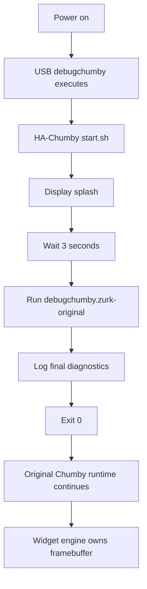

# Web Runtime Restoration

Status: Sprint 10 runtime restoration note.

Sprint 10 restores the original Zurk web runtime while preserving the HA-Chumby USB overlay. The overlay is finite: it displays the HA-Chumby splash, restores Zurk startup, logs diagnostics, and exits so the original Chumby runtime can continue.

## Runtime Evidence

| Fact | Evidence |
| --- | --- |
| BusyBox `httpd` runs before Zurk restoration. | Sprint 9 diagnostics: `/usr/sbin/httpd -h /mnt/usb/www -c /psp/httpd.conf`. |
| BusyBox document root is `/mnt/usb/www`. | Sprint 9 diagnostics process command line. |
| Chumote CGI became available after restoring web services. | Real hardware validation before this update. |
| Chumote events execute but have no visible effect while the HA-Chumby loop owns the framebuffer. | Real hardware validation before this update. |
| Zurk CGI scripts exist under `/mnt/usb/lighty/cgi-bin`. | Sprint 9 diagnostics and USB filesystem inventory. |
| Original Zurk startup is preserved as `/mnt/usb/debugchumby.zurk-original`. | USB filesystem inspection. |
| Original Zurk startup starts lighttpd with `/mnt/usb/lighty/lighttpd.conf`. | `/mnt/usb/debugchumby.zurk-original`. |

## Chosen Strategy

Chosen strategy: restore Zurk startup, then return to the original boot sequence.

The previous persistent loop proved that web services can be restored, but it also prevented the normal UI/widget runtime from starting. The current implementation draws the HA-Chumby splash first, runs the preserved original Zurk startup, records diagnostics, and exits.

## Execution Order



## Services Started

The preserved Zurk startup remains responsible for:

- stopping the built-in BusyBox `httpd`
- starting lighttpd with `/mnt/usb/lighty/lighttpd.conf`
- binding `/mnt/usb/scripts` over `/usr/chumby/scripts` in networkless mode
- handling optional Zurk USB flags
- running `/usr/chumby/scripts/fb_cgi.sh`

HA-Chumby does not replace those services.

## Diagnostics

Diagnostics are written to:

```text
/tmp/ha-chumby.log
/mnt/usb/ha-chumby/boot-diagnostics.txt
```

The log records startup sequence, executed scripts, exit codes, process snapshots, listening ports, runtime file checks, and framebuffer process clues when discoverable.

## Known Limitations

- The overlay does not remain running after hand-off.
- The splash is not persistent by design.
- Framebuffer owner detection is best-effort only.
- Home Assistant control remains postponed until hardware confirms the original runtime handles Chumote events again.
