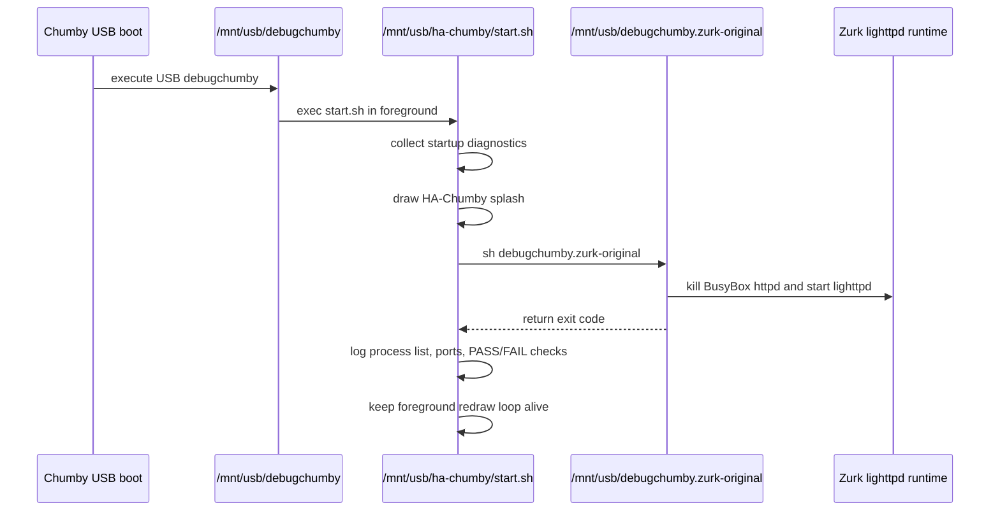

# Web Runtime Restoration

Status: Sprint 10 implementation document.

Sprint 10 restores the original Zurk web runtime while preserving the HA-Chumby USB overlay. The goal is to behave like a stock Zurk installation plus the HA-Chumby splash screen, not to replace the Zurk runtime.

## Runtime Evidence

| Fact | Evidence |
| --- | --- |
| BusyBox `httpd` is running before restoration. | Sprint 9 diagnostics: `/usr/sbin/httpd -h /mnt/usb/www -c /psp/httpd.conf`. |
| BusyBox document root is `/mnt/usb/www`. | Sprint 9 diagnostics process command line. |
| BusyBox config is `/psp/httpd.conf`. | Sprint 9 diagnostics process command line and config dump. |
| `/psp/httpd.conf` only maps `.xml` to `application/xml`. | Sprint 9 diagnostics and USB file contents. |
| Zurk CGI scripts exist under `/mnt/usb/lighty/cgi-bin`. | Sprint 9 diagnostics and USB filesystem inventory. |
| Zurk lighttpd exists under `/mnt/usb/lighty`. | Sprint 9 diagnostics and USB filesystem inventory. |
| Original Zurk startup is preserved as `/mnt/usb/debugchumby.zurk-original`. | USB filesystem inspection. |
| Original Zurk startup kills BusyBox `httpd`, starts lighttpd with `/mnt/usb/lighty/lighttpd.conf`, binds `/mnt/usb/scripts`, handles optional flags, and starts `fb_cgi.sh`. | `/mnt/usb/debugchumby.zurk-original`. |
| Zurk also includes `/mnt/usb/lighty/startup.sh`, which kills `httpd` and starts lighttpd. | `/mnt/usb/lighty/startup.sh`. |

## Chosen Strategy

Chosen strategy: Option A, execute the original Zurk startup after the HA-Chumby framebuffer confirmation.

This is the smallest restoration because it delegates the runtime sequence back to Zurk instead of reimplementing it in HA-Chumby. The HA-Chumby script only controls ordering and logging:

1. collect minimal startup diagnostics
2. draw the HA-Chumby splash screen
3. execute `/mnt/usb/debugchumby.zurk-original`
4. log exit code and runtime state
5. keep the HA-Chumby foreground redraw loop alive

## Fallback Strategy

If `/mnt/usb/debugchumby.zurk-original` is missing, `start.sh` executes `/mnt/usb/lighty/startup.sh` as a narrower web-service fallback.

That fallback is Option B. It is not preferred because it skips non-web behavior from the original Zurk startup, but it still uses Zurk's own lighttpd startup script rather than inventing a new web-server launch command.

Directly starting lighttpd from HA-Chumby remains Option C and is not implemented in Sprint 10.

## Execution Order



## Services Started By Restored Zurk Startup

| Service or action | Source |
| --- | --- |
| Stop built-in BusyBox `httpd` | `/mnt/usb/debugchumby.zurk-original` |
| Start lighttpd with `LD_LIBRARY_PATH=/mnt/usb/lighty/lib` | `/mnt/usb/debugchumby.zurk-original` |
| Use `/mnt/usb/lighty/lighttpd.conf` | `/mnt/usb/debugchumby.zurk-original` |
| Bind `/mnt/usb/scripts` over `/usr/chumby/scripts` in networkless mode | `/mnt/usb/debugchumby.zurk-original` |
| Handle optional `clearsshpwd.on`, `dlna.on`, and `swapfile.on` flags | `/mnt/usb/debugchumby.zurk-original` |
| Copy `/mnt/usb/www/gif.swf` to `/tmp` | `/mnt/usb/debugchumby.zurk-original` |
| Run `/usr/chumby/scripts/fb_cgi.sh` | `/mnt/usb/debugchumby.zurk-original` |

## Diagnostics

Sprint 10 diagnostics are written to:

```text
/tmp/ha-chumby.log
/mnt/usb/ha-chumby/boot-diagnostics.txt
```

The log records:

- whether the original Zurk startup was found
- whether it was executed
- startup exit code
- process list before and after startup
- listening ports before and after startup
- lighttpd output marker `/mnt/usb/tmp/write.ok`
- PASS/FAIL checks for lighttpd, BusyBox httpd, CGI directory, `speak.pl`, and lighttpd config

## Validation Expectations

| Check | Expected after Sprint 10 |
| --- | --- |
| HA-Chumby splash appears first | PASS |
| `/mnt/usb/debugchumby.zurk-original` executes | PASS when file exists |
| lighttpd process is running | PASS |
| `/mnt/usb/lighty/cgi-bin` exists | PASS |
| `/mnt/usb/lighty/cgi-bin/speak.pl` exists | PASS |
| BusyBox `httpd` running | Expected FAIL if original Zurk startup successfully killed it |
| Port 80 listening | PASS, served by lighttpd |
| `/cgi-bin/speak.pl` reachable over HTTP | Must be tested manually after boot |

## Known Limitations

- The original Zurk startup speaks welcome messages. Sprint 10 preserves that behavior because the goal is restoration, not replacement.
- The original Zurk startup may process optional files such as `clearsshpwd.on`, `dlna.on`, and `swapfile.on` if they exist on the USB stick.
- The HA-Chumby foreground loop still redraws the splash every two seconds. If Zurk widgets need uninterrupted framebuffer ownership later, that loop may need a separate runtime mode.
- Sprint 10 restores startup behavior; it does not implement Home Assistant control.
