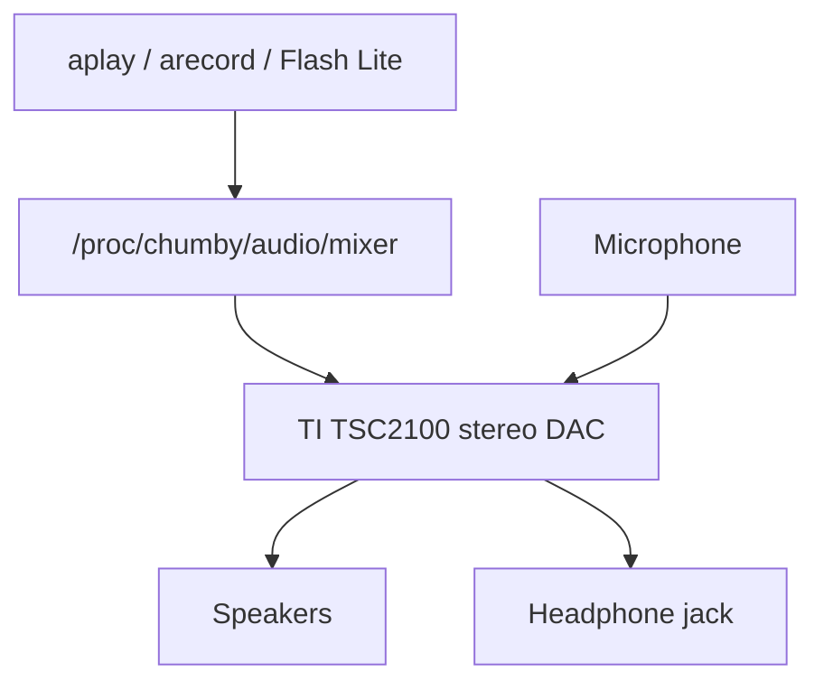

# Chumby Classic Audio Knowledge Base

Scope: Chumby Classic / Ironforge audio hardware and exposed audio controls; the Chumby Wiki identifies Chumby Classic as Ironforge. [Source](https://wiki.chumby.com/index.php?title=Devices)

## Verified Facts

| Topic | Fact | Source |
| --- | --- | --- |
| Audio controller | The hardware page lists the Texas Instruments TSC2100 as a touchscreen controller with stereo DAC. | [Hacking hardware](https://wiki.chumby.com/index.php?title=Hacking_hardware_for_chumby#What.27s_in_a_chumby_classic.3F) |
| Speakers | Chumby Classic has two 2 W speakers. | [Devices](https://wiki.chumby.com/index.php?title=Devices) |
| Headphone | Chumby Classic has a headphone jack. | [Devices](https://wiki.chumby.com/index.php?title=Devices) |
| Microphone | Chumby Classic has a microphone. | [Devices](https://wiki.chumby.com/index.php?title=Devices) |
| TSC2100 audio paths | `/proc/chumby/tsc2100/` includes `audiodac-page2`, `audioadc-page2`, and `sidetone-page2`. | [/proc](https://wiki.chumby.com/index.php?title=Chumby_device_settings_information_on_%2Fproc) |
| Audio namespace | `/proc/chumby/audio` is documented under `/proc/chumby`. | [/proc](https://wiki.chumby.com/index.php?title=Chumby_device_settings_information_on_%2Fproc) |
| Mixer namespace | `/proc/chumby/audio/mixer` is documented under the Chumby audio namespace. | [/proc](https://wiki.chumby.com/index.php?title=Chumby_device_settings_information_on_%2Fproc) |
| Mixer channels | Mixer paths are documented for both speakers, right speaker, and left speaker. | [/proc](https://wiki.chumby.com/index.php?title=Chumby_device_settings_information_on_%2Fproc) |
| Mixer volume | Volume paths are documented for both speakers, right speaker, and left speaker. | [/proc](https://wiki.chumby.com/index.php?title=Chumby_device_settings_information_on_%2Fproc) |
| Mixer mute | Mute paths are documented for both speakers, right speaker, and left speaker. | [/proc](https://wiki.chumby.com/index.php?title=Chumby_device_settings_information_on_%2Fproc) |
| Headphone detect | `/proc/sys/sense1/hpin` contains `1` when something is plugged into the headphone jack. | [/proc](https://wiki.chumby.com/index.php?title=Chumby_device_settings_information_on_%2Fproc) |
| Headphone manager | `headphone_manager` disables internal speakers when headphones or external speakers are plugged in. | [Software tools](https://wiki.chumby.com/index.php?title=Chumby_Software_Applications%2C_Scripts_and_Tools) |
| Audio tools | The software tools page lists `amixer`, `aplay`, and `arecord` under `/usr/bin`. | [Software tools](https://wiki.chumby.com/index.php?title=Chumby_Software_Applications%2C_Scripts_and_Tools) |
| Playback formats | `aplay` plays voc, wav, raw, or au files. | [Software tools](https://wiki.chumby.com/index.php?title=Chumby_Software_Applications%2C_Scripts_and_Tools) |
| Recording | The software tools page documents `arecord -f cd test.wav` as a microphone recording example. | [Software tools](https://wiki.chumby.com/index.php?title=Chumby_Software_Applications%2C_Scripts_and_Tools) |
| MP3 | Ironforge widget documentation lists external MP3 file support. | [Developing widgets](https://wiki.chumby.com/index.php?title=Developing_widgets_for_chumby) |

## Diagram

The diagram summarizes documented audio hardware and controls. [Hacking hardware](https://wiki.chumby.com/index.php?title=Hacking_hardware_for_chumby#What.27s_in_a_chumby_classic.3F), [/proc](https://wiki.chumby.com/index.php?title=Chumby_device_settings_information_on_%2Fproc), [Software tools](https://wiki.chumby.com/index.php?title=Chumby_Software_Applications%2C_Scripts_and_Tools)

## Assumptions

No assumptions are used as facts in this document.

## Open Questions

- What exact ALSA device names exist on stock HW 3.7 firmware?
- What numeric range is accepted by mixer volume paths?
- What values are accepted by mixer mute paths?
- Which audio sample rates are reliable outside Flash Lite?
- Can microphone capture be used without Flash Lite?
