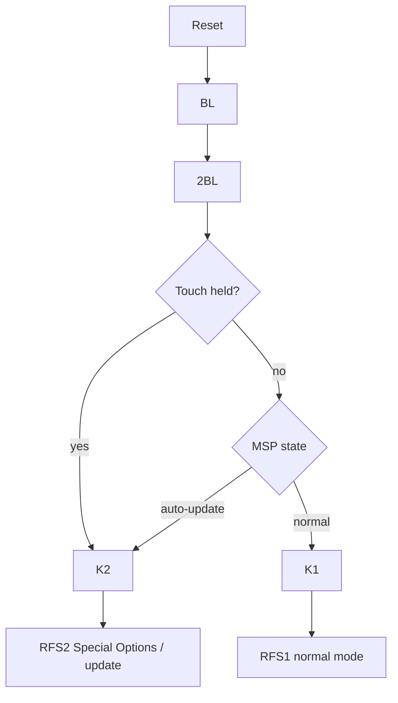

# Chumby Classic Boot Knowledge Base

Scope: Chumby Classic / Ironforge boot behavior; the Chumby Wiki identifies Chumby Classic as Ironforge. [Source](https://wiki.chumby.com/index.php?title=Devices)

## Verified Facts

| Topic | Fact | Source |
| --- | --- | --- |
| Normal mode | Ironforge boot customization notes refer to normal mode as `rfs1`. | [Chumby tricks](https://wiki.chumby.com/index.php?title=Chumby_tricks#Running_something_at_boot_without_debugchumby_.28IronForge_Chumby_Classic_ONLY.29) |
| Special Options | Ironforge recovery notes refer to Special Options mode as `rfs2`. | [Chumby tricks](https://wiki.chumby.com/index.php?title=Chumby_tricks#Running_something_at_boot_without_debugchumby_.28IronForge_Chumby_Classic_ONLY.29) |
| Special Options entry | Special Options mode is reached by powering on while pressing the touchscreen. | [Chumby tricks](https://wiki.chumby.com/index.php?title=Chumby_tricks#Running_something_at_boot_without_debugchumby_.28IronForge_Chumby_Classic_ONLY.29) |
| Init script | The Chumby tricks page says `/etc/init.d/rcS` runs at boot. | [Chumby tricks](https://wiki.chumby.com/index.php?title=Chumby_tricks#Running_something_at_boot_without_debugchumby_.28IronForge_Chumby_Classic_ONLY.29) |
| Normal override | Ironforge normal boot can run `/psp/rfs1/rcS`. | [Chumby tricks](https://wiki.chumby.com/index.php?title=Chumby_tricks#Running_something_at_boot_without_debugchumby_.28IronForge_Chumby_Classic_ONLY.29) |
| Recovery | A broken `/psp/rfs1/rcS` can be removed from Special Options mode using USB `debugchumby`. | [Chumby tricks](https://wiki.chumby.com/index.php?title=Chumby_tricks#Running_something_at_boot_without_debugchumby_.28IronForge_Chumby_Classic_ONLY.29) |
| Startup script | A USB file named `debugchumby` can contain startup shell commands. | [Chumby tricks](https://wiki.chumby.com/index.php?title=Chumby_tricks#Run_processes_on_start-up) |
| Startup hooks | `userhook0`, `userhook1`, and `userhook2` can be placed on USB root or under `/psp/rfs1/`. | [Chumby tricks](https://wiki.chumby.com/index.php?title=Chumby_tricks#Run_processes_on_start-up) |
| Splash sequence | The Chumby tricks page says normal boot displays four images before the opening animation. | [Chumby tricks](https://wiki.chumby.com/index.php?title=Chumby_tricks#Your_own_splash_screens) |
| Bootloader splash | The first two splash images are displayed by the bootloader. | [Chumby tricks](https://wiki.chumby.com/index.php?title=Chumby_tricks#Bootloader_Screens) |
| Kernel splash | The third splash image is displayed by the kernel. | [Chumby tricks](https://wiki.chumby.com/index.php?title=Chumby_tricks#Kernel_Screen) |
| Init splash | The fourth splash image is displayed by `/etc/init.d/rcS`. | [Chumby tricks](https://wiki.chumby.com/index.php?title=Chumby_tricks#Init_Script_Screen) |
| Partition names | The Chumby update patent defines `K1`, `RFS1`, `K2`, `RFS2`, `BL`, `2BL`, `PSP`, `TST`, and `MSP`. | [Google Patents US8839224B2](https://patents.google.com/patent/US8839224B2/en) |
| Normal boot model | The update patent says the bootloader loads `K1`, and `K1` initializes `RFS1` for normal operation. | [Google Patents US8839224B2](https://patents.google.com/patent/US8839224B2/en) |
| Auto-update model | The update patent says `K2` loads `RFS2` for auto-update mode. | [Google Patents US8839224B2](https://patents.google.com/patent/US8839224B2/en) |
| MSP role | The update patent describes `MSP` as a mode sense page used for the auto-update or normal-mode semaphore. | [Google Patents US8839224B2](https://patents.google.com/patent/US8839224B2/en) |

## Diagram

The following flow summarizes the Chumby update patent boot model and the Chumby Wiki Special Options entry path. [Patent](https://patents.google.com/patent/US8839224B2/en), [Chumby tricks](https://wiki.chumby.com/index.php?title=Chumby_tricks#Running_something_at_boot_without_debugchumby_.28IronForge_Chumby_Classic_ONLY.29)

## Assumptions

No assumptions are used as facts in this document.

## Open Questions

- What bootloader implementation and version are present on HW 3.7?
- Does the bootloader expose an interactive serial console?
- What exact path executes `debugchumby`?
- What NAND offsets correspond to the named update partitions?
