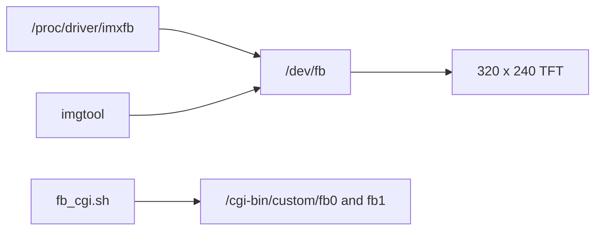

# Chumby Classic Display Knowledge Base

Scope: Chumby Classic / Ironforge display and framebuffer behavior; the Chumby Wiki identifies Chumby Classic as Ironforge. [Source](https://wiki.chumby.com/index.php?title=Devices)

## Verified Facts

| Topic | Fact | Source |
| --- | --- | --- |
| Resolution | Chumby Classic has a 320 x 240 x 16 TFT display with touchscreen. | [Devices](https://wiki.chumby.com/index.php?title=Devices) |
| Module | The hardware page lists a DataImage 320 h x 240 v 16 bpp TFT display with touchscreen. | [Hacking hardware](https://wiki.chumby.com/index.php?title=Hacking_hardware_for_chumby#What.27s_in_a_chumby_classic.3F) |
| Framebuffer | The `/dev` page describes `/dev/fb` as video memory where writes draw pixels on the screen. | [/dev](https://wiki.chumby.com/index.php?title=Chumby_device_settings_information_on_%2Fdev) |
| Framebuffer example | The `/dev` page links `fbwrite-1.0.tar.gz` as an Ironforge framebuffer example. | [/dev](https://wiki.chumby.com/index.php?title=Chumby_device_settings_information_on_%2Fdev) |
| Composite control | `/proc/driver/imxfb/enable` contains `0` for framebuffer 0 and `1` to composite framebuffer 1 over framebuffer 0. | [/proc](https://wiki.chumby.com/index.php?title=Chumby_device_settings_information_on_%2Fproc) |
| Alpha control | `/proc/driver/imxfb/alpha` contains a hexadecimal alpha value between `0x00` and `0xff`. | [/proc](https://wiki.chumby.com/index.php?title=Chumby_device_settings_information_on_%2Fproc) |
| FB CGI | The hidden Control Panel includes `FB CGI`, which enables framebuffer access through CGI. | [Chumby tricks](https://wiki.chumby.com/index.php?title=Chumby_tricks#Hidden_screen_in_Control_Panel) |
| FB CGI script | `/usr/chumby/scripts/fb_cgi.sh` starts framebuffer CGI setup from the command line. | [Chumby tricks](https://wiki.chumby.com/index.php?title=Chumby_tricks#Using_a_browser_to_see_what.27s_on_your_chumby) |
| FB CGI endpoints | `/cgi-bin/custom/fb0` exposes the widget framebuffer and `/cgi-bin/custom/fb1` exposes the Control Panel framebuffer. | [Chumby tricks](https://wiki.chumby.com/index.php?title=Chumby_tricks#Accessing_the_contents_of_the_frame_buffers) |
| FB CGI image | The Chumby tricks page says the framebuffer CGI endpoint responds with a JPEG image. | [Chumby tricks](https://wiki.chumby.com/index.php?title=Chumby_tricks#Accessing_the_contents_of_the_frame_buffers) |
| imgtool | `imgtool` can draw an image on the screen or capture the screen to an image file. | [Software tools](https://wiki.chumby.com/index.php?title=Chumby_Software_Applications%2C_Scripts_and_Tools) |
| imgtool framebuffer | `imgtool --fb=0` targets the widget framebuffer and `imgtool --fb=1` targets the Control Panel framebuffer. | [Software tools](https://wiki.chumby.com/index.php?title=Chumby_Software_Applications%2C_Scripts_and_Tools) |
| Flash Lite | Ironforge widgets target Adobe Flash Lite 3.1. | [Developing widgets](https://wiki.chumby.com/index.php?title=Developing_widgets_for_chumby) |

## Diagram

The diagram summarizes documented framebuffer access paths. [/dev](https://wiki.chumby.com/index.php?title=Chumby_device_settings_information_on_%2Fdev), [Chumby tricks](https://wiki.chumby.com/index.php?title=Chumby_tricks#Using_a_browser_to_see_what.27s_on_your_chumby)

## Assumptions

No assumptions are used as facts in this document.

## Open Questions

- What exact framebuffer nodes exist on HW 3.7?
- What pixel byte order does `/dev/fb0` use?
- What stride and padding values does the framebuffer expose?
- What LCD backlight controls exist on HW 3.7?
- Can SDL2 run on the target firmware?
