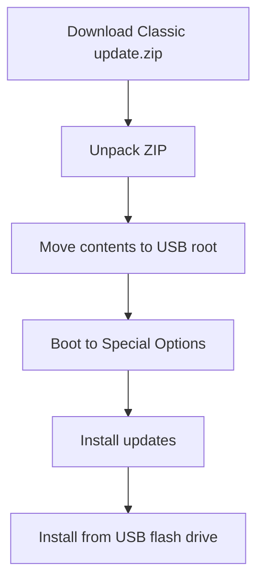

# Chumby Classic Firmware Knowledge Base

Scope: Chumby Classic / Ironforge firmware and source availability; the Chumby Wiki identifies Chumby Classic as Ironforge. [Source](https://wiki.chumby.com/index.php?title=Devices)

## Verified Facts

| Topic | Fact | Source |
| --- | --- | --- |
| GPL/LGPL source | Chumby states that GPL and LGPL source code in the product is available from `http://files.chumby.com/source`. | [Chumby source](https://www.chumby.com/source) |
| On-device licenses | Chumby says GPL and LGPL licenses are available through Control Panel, Settings, Chumby Info, Software Licenses. | [Chumby source](https://www.chumby.com/source) |
| Classic recovery package | The troubleshooting page lists the Classic firmware package as `http://files.chumby.com/resources/classic/1-7-3/update.zip`. | [Troubleshooting](https://wiki.chumby.com/index.php?title=Troubleshooting) |
| Classic package layout | Classic update ZIP contents are unpacked and moved to the USB flash drive top level. | [Troubleshooting](https://wiki.chumby.com/index.php?title=Troubleshooting) |
| Firmware restore UI | Firmware restore uses Special Options mode, `Install updates`, and `Install from USB flash drive`. | [Troubleshooting](https://wiki.chumby.com/index.php?title=Troubleshooting) |
| Update warning | The troubleshooting page warns not to unplug the device during update. | [Troubleshooting](https://wiki.chumby.com/index.php?title=Troubleshooting) |
| 1.7 kernel source | Chumby documents `linux-2.6.16-chumby-1.7.0.tar.gz` for Classic firmware 1.7. | [Hacking Linux](https://wiki.chumby.com/index.php?title=Hacking_Linux_for_chumby#Building_the_chumby_1.7_kernel) |
| 1.6 kernel source | Chumby documents `linux-2.6.16-chumby-1.6.0.tar.gz` for Classic firmware 1.6. | [Hacking Linux](https://wiki.chumby.com/index.php?title=Hacking_Linux_for_chumby#Building_the_chumby_1.6_kernel) |
| 1.5 kernel source | Chumby documents `linux-2.6.16-chumby-1.5.0.tar.gz` for Classic firmware 1.5. | [Hacking Linux](https://wiki.chumby.com/index.php?title=Hacking_Linux_for_chumby#Building_the_chumby_1.5_kernel) |
| WiFi source | Chumby documents `rt73-chumby-1.7.0.tar.gz` for the Ralink WiFi driver. | [Hacking Linux](https://wiki.chumby.com/index.php?title=Hacking_Linux_for_chumby#Building_the_Wi-Fi_driver) |
| Stock tools | The software tools page documents scripts and applications pre-installed on a stock Chumby distribution. | [Software tools](https://wiki.chumby.com/index.php?title=Chumby_Software_Applications%2C_Scripts_and_Tools) |
| Flash player | The software tools page lists `chumbyflashplayer.x` as the Adobe Flash Lite 3 Player customized for Chumby. | [Software tools](https://wiki.chumby.com/index.php?title=Chumby_Software_Applications%2C_Scripts_and_Tools) |
| Flash Lite | Ironforge widgets target Adobe Flash Lite 3.1. | [Developing widgets](https://wiki.chumby.com/index.php?title=Developing_widgets_for_chumby) |
| Web server | The Chumby tricks page says Chumby launches a small HTTP server on port 80 at startup. | [Chumby tricks](https://wiki.chumby.com/index.php?title=Chumby_tricks#Built_in_web_server) |
| BusyBox HTTP | The BusyBox HTTP server page says Chumby Classic runs a simple HTTP server using BusyBox. | [BusyBox HTTP](https://wiki.chumby.com/index.php?title=Using_the_busybox_HTTP_server) |
| CGI path | The BusyBox HTTP server page says CGI scripts can be added under `/psp/cgi-bin`. | [BusyBox HTTP](https://wiki.chumby.com/index.php?title=Using_the_busybox_HTTP_server) |
| SSH daemon | The hidden Control Panel includes `SSHD`, which launches the built-in SSH daemon. | [Chumby tricks](https://wiki.chumby.com/index.php?title=Chumby_tricks#Hidden_screen_in_Control_Panel) |
| SSH login | The Chumby tricks page documents SSH login as `root` with no password after starting `sshd`. | [Chumby tricks](https://wiki.chumby.com/index.php?title=Chumby_tricks#Open_a_secure_shell_.28SSH.29_console_on_the_chumby) |
| SSH flag | Creating `/psp/start_sshd` starts `sshd` whenever Chumby connects to a network. | [Chumby tricks](https://wiki.chumby.com/index.php?title=Chumby_tricks#Launching_sshd_at_startup) |

## Diagram

The diagram summarizes the documented Classic firmware restore path. [Troubleshooting](https://wiki.chumby.com/index.php?title=Troubleshooting)

## Assumptions

No assumptions are used as facts in this document.

## Open Questions

- What exact firmware version is installed on the target HW 3.7 unit?
- What are the checksums and contents of `1-7-3/update.zip`?
- Which stock firmware components are proprietary?
- Can published source archives reproduce stock binaries?
- What firmware files are required for offline development?
