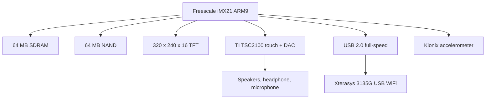

# Chumby Classic Hardware Knowledge Base

Scope: Chumby Classic / Ironforge hardware, with emphasis on beanbag HW 3.7; the Chumby Wiki identifies Chumby Classic as Ironforge. [Source](https://wiki.chumby.com/index.php?title=Devices)

## Verified Facts

| Topic | Fact | Source |
| --- | --- | --- |
| Product | The Chumby Wiki lists `Chumby Classic (Ironforge)` as a Chumby device. | [Devices](https://wiki.chumby.com/index.php?title=Devices) |
| CPU | Chumby Classic uses a Freescale iMX21 ARM926EJ-S processor at 350 MHz. | [Devices](https://wiki.chumby.com/index.php?title=Devices) |
| CPU part | The hardware page lists `Freescale iMX21 MC94MX21DVKN3 ARM9 controller`. | [Hacking hardware](https://wiki.chumby.com/index.php?title=Hacking_hardware_for_chumby#What.27s_in_a_chumby_classic.3F) |
| RAM | Chumby Classic has 64 MB RAM. | [Devices](https://wiki.chumby.com/index.php?title=Devices) |
| RAM detail | The hardware page lists Samsung 64 MB SDRAM on a 32-bit data path. | [Hacking hardware](https://wiki.chumby.com/index.php?title=Hacking_hardware_for_chumby#What.27s_in_a_chumby_classic.3F) |
| NAND | Chumby Classic has 64 MB NAND. | [Devices](https://wiki.chumby.com/index.php?title=Devices) |
| NAND detail | The hardware page lists Hynix `HY27US` 64 MB NAND Flash ROM. | [Hacking hardware](https://wiki.chumby.com/index.php?title=Hacking_hardware_for_chumby#What.27s_in_a_chumby_classic.3F) |
| Display | Chumby Classic has a 320 x 240 x 16 TFT display with touchscreen. | [Devices](https://wiki.chumby.com/index.php?title=Devices) |
| Touch/audio | The hardware page lists a Texas Instruments TSC2100 touchscreen controller with stereo DAC. | [Hacking hardware](https://wiki.chumby.com/index.php?title=Hacking_hardware_for_chumby#What.27s_in_a_chumby_classic.3F) |
| Audio | The device table lists two 2 W speakers, a headphone jack, and microphone. | [Devices](https://wiki.chumby.com/index.php?title=Devices) |
| USB | The device table lists two USB 2.0 full-speed ports. | [Devices](https://wiki.chumby.com/index.php?title=Devices) |
| USB detail | The hardware page lists three USB 2.0 full-speed ports: one internal and two external. | [Hacking hardware](https://wiki.chumby.com/index.php?title=Hacking_hardware_for_chumby#What.27s_in_a_chumby_classic.3F) |
| WiFi | The hardware page lists an Xterasys 3135G 802.11g USB WiFi adapter with Ralink chipset. | [Hacking hardware](https://wiki.chumby.com/index.php?title=Hacking_hardware_for_chumby#What.27s_in_a_chumby_classic.3F) |
| Accelerometer | The hardware page lists a Kionix KXP74-1050 3-axis accelerometer. | [Hacking hardware](https://wiki.chumby.com/index.php?title=Hacking_hardware_for_chumby#What.27s_in_a_chumby_classic.3F) |
| Backlight | The device table says variable backlight is for version 3.8 only. | [Devices](https://wiki.chumby.com/index.php?title=Devices) |

## Diagram

The following block diagram summarizes components listed by the Chumby Wiki device and hardware pages. [Devices](https://wiki.chumby.com/index.php?title=Devices), [Hacking hardware](https://wiki.chumby.com/index.php?title=Hacking_hardware_for_chumby#What.27s_in_a_chumby_classic.3F)

## Assumptions

No assumptions are used as facts in this document.

## Open Questions

- What exact HW 3.7 markings are present on the target unit?
- What exact NAND partition offsets exist on the target unit?
- What exact LCD timing values are used by HW 3.7?
- What debug headers are populated or unpopulated on HW 3.7?
