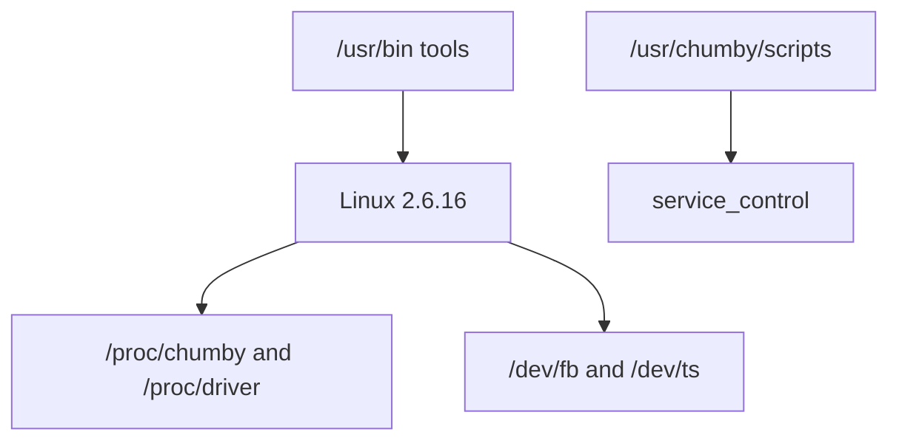

# Chumby Classic Linux Knowledge Base

Scope: Chumby Classic / Ironforge Linux userspace, kernel, drivers, tools, and service surfaces; the Chumby Wiki identifies Chumby Classic as Ironforge. [Source](https://wiki.chumby.com/index.php?title=Devices)

## Verified Facts

| Topic | Fact | Source |
| --- | --- | --- |
| Production kernel | The deprecated Ironforge section says production Chumby runs Linux kernel `2.6.16`. | [Hacking Linux](https://wiki.chumby.com/index.php?title=Hacking_Linux_for_chumby#Ironforge) |
| Firmware 1.7 kernel | Classic firmware version 1.7 ships Linux `2.6.16`. | [Hacking Linux](https://wiki.chumby.com/index.php?title=Hacking_Linux_for_chumby#Building_the_chumby_1.7_kernel) |
| Firmware 1.6 kernel | Classic firmware version 1.6 ships Linux `2.6.16`. | [Hacking Linux](https://wiki.chumby.com/index.php?title=Hacking_Linux_for_chumby#Building_the_chumby_1.6_kernel) |
| Firmware 1.5 kernel | Classic firmware version 1.5 ships Linux `2.6.16`. | [Hacking Linux](https://wiki.chumby.com/index.php?title=Hacking_Linux_for_chumby#Building_the_chumby_1.5_kernel) |
| Build command | Classic 1.7 kernel instructions use `ARCH=arm BOARD=mx21ads CROSS_COMPILE=arm-linux- make`. | [Hacking Linux](https://wiki.chumby.com/index.php?title=Hacking_Linux_for_chumby#Building_the_chumby_1.7_kernel) |
| Kernel package | Classic 1.7 instructions package `arch/arm/boot/zImage` as `k1.bin.zip`. | [Hacking Linux](https://wiki.chumby.com/index.php?title=Hacking_Linux_for_chumby#Building_the_chumby_1.7_kernel) |
| 1.7 toolchain | Classic 1.7 kernel instructions use the GNU Toolchain with GCC 4.3.2. | [Hacking Linux](https://wiki.chumby.com/index.php?title=Hacking_Linux_for_chumby#Building_the_chumby_1.7_kernel) |
| 1.6 toolchain | Classic 1.6 kernel instructions use GCC 4.1.2b. | [Hacking Linux](https://wiki.chumby.com/index.php?title=Hacking_Linux_for_chumby#Building_the_chumby_1.6_kernel) |
| CPU info | The `/proc` page shows `/proc/cpuinfo` reporting ARM926EJ-S and CPU architecture `5TEJ`. | [/proc](https://wiki.chumby.com/index.php?title=Chumby_device_settings_information_on_%2Fproc) |
| Proc warning | The `/proc` page warns not to write code that expects all listed files to remain in `/proc`. | [/proc](https://wiki.chumby.com/index.php?title=Chumby_device_settings_information_on_%2Fproc) |
| Script path | Stock scripts are listed under `/usr/chumby/scripts/`. | [Software tools](https://wiki.chumby.com/index.php?title=Chumby_Software_Applications%2C_Scripts_and_Tools) |
| App path | Stock applications are listed under `/usr/bin`. | [Software tools](https://wiki.chumby.com/index.php?title=Chumby_Software_Applications%2C_Scripts_and_Tools) |
| Network tools | The stock tool list includes `curl`, `scp`, `ssh`, and `wget`. | [Software tools](https://wiki.chumby.com/index.php?title=Chumby_Software_Applications%2C_Scripts_and_Tools) |
| Diagnostics | The stock tool list includes `gdbserver`, `hexdump`, `memstress`, and `udevinfo`. | [Software tools](https://wiki.chumby.com/index.php?title=Chumby_Software_Applications%2C_Scripts_and_Tools) |
| Perl | The stock tool list says `perl` is version 5.8.8 built for Linux. | [Software tools](https://wiki.chumby.com/index.php?title=Chumby_Software_Applications%2C_Scripts_and_Tools) |
| Service wrapper | The stock tool list documents `service_control service_name action [args]`. | [Software tools](https://wiki.chumby.com/index.php?title=Chumby_Software_Applications%2C_Scripts_and_Tools) |
| WiFi interface example | The ad-hoc WiFi example uses interface `rausb0`. | [Chumby tricks](https://wiki.chumby.com/index.php?title=Chumby_tricks#Setting_up_an_adhoc_wifi_network) |

## Diagram

The diagram summarizes documented stock Linux surfaces. [Hacking Linux](https://wiki.chumby.com/index.php?title=Hacking_Linux_for_chumby), [Software tools](https://wiki.chumby.com/index.php?title=Chumby_Software_Applications%2C_Scripts_and_Tools), [/proc](https://wiki.chumby.com/index.php?title=Chumby_device_settings_information_on_%2Fproc)

## Assumptions

No assumptions are used as facts in this document.

## Open Questions

- Is Python present on stock Classic firmware?
- If Python is present, what exact version is installed?
- Is there a stock package manager command?
- What init scripts are present beyond `/etc/init.d/rcS`?
- What kernel configuration is enabled in the target firmware?
