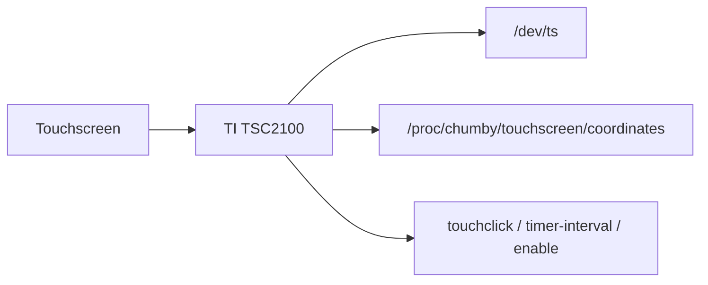

# Chumby Classic Touch Knowledge Base

Scope: Chumby Classic / Ironforge touchscreen hardware and exposed touch interfaces; the Chumby Wiki identifies Chumby Classic as Ironforge. [Source](https://wiki.chumby.com/index.php?title=Devices)

## Verified Facts

| Topic | Fact | Source |
| --- | --- | --- |
| Touch display | Chumby Classic has a 320 x 240 x 16 TFT display with touchscreen. | [Devices](https://wiki.chumby.com/index.php?title=Devices) |
| Touch controller | The hardware page lists a Texas Instruments TSC2100 programmable touchscreen controller. | [Hacking hardware](https://wiki.chumby.com/index.php?title=Hacking_hardware_for_chumby#What.27s_in_a_chumby_classic.3F) |
| Direct device | `/dev/ts` is documented as directly connected with the touchscreen driver. | [/dev](https://wiki.chumby.com/index.php?title=Chumby_device_settings_information_on_%2Fdev) |
| `/dev/ts` sample | The `/dev` page example reads pressure, x, y, and an unknown value from `/dev/ts`. | [/dev](https://wiki.chumby.com/index.php?title=Chumby_device_settings_information_on_%2Fdev) |
| Touch namespace | `/proc/chumby/touchscreen` is documented under `/proc/chumby`. | [/proc](https://wiki.chumby.com/index.php?title=Chumby_device_settings_information_on_%2Fproc) |
| Touch click | `/proc/chumby/touchscreen/touchclick` contains `1` when click feedback is enabled and `0` when disabled. | [/proc](https://wiki.chumby.com/index.php?title=Chumby_device_settings_information_on_%2Fproc) |
| Poll interval | `/proc/chumby/touchscreen/timer-interval` shows when coordinate and pressure data are polled. | [/proc](https://wiki.chumby.com/index.php?title=Chumby_device_settings_information_on_%2Fproc) |
| Coordinates | `/proc/chumby/touchscreen/coordinates` shows recent touchscreen events. | [/proc](https://wiki.chumby.com/index.php?title=Chumby_device_settings_information_on_%2Fproc) |
| Event types | The `/proc` page documents pen-up and pen-down events. | [/proc](https://wiki.chumby.com/index.php?title=Chumby_device_settings_information_on_%2Fproc) |
| Pen-up | The `/proc` page says pen-up is logged when touch stops and coordinates are always `0`. | [/proc](https://wiki.chumby.com/index.php?title=Chumby_device_settings_information_on_%2Fproc) |
| Pen-down | The `/proc` page says pen-down is logged while touching and includes x, y, and pressure. | [/proc](https://wiki.chumby.com/index.php?title=Chumby_device_settings_information_on_%2Fproc) |
| Enable path | `/proc/chumby/touchscreen/enable` contains `1` when enabled and `0` when disabled. | [/proc](https://wiki.chumby.com/index.php?title=Chumby_device_settings_information_on_%2Fproc) |
| Calibration recovery | A USB file named `ts_settings` can restore calibration enough to navigate Control Panel calibration. | [Chumby tricks](https://wiki.chumby.com/index.php?title=Chumby_tricks#Screwed_up_your_touchscreen_calibration.3F) |
| Flash input | Ironforge widget documentation says mouseMove events occur only while mouseDown. | [Developing widgets](https://wiki.chumby.com/index.php?title=Developing_widgets_for_chumby) |

## Diagram

The diagram summarizes documented touch interfaces. [/dev](https://wiki.chumby.com/index.php?title=Chumby_device_settings_information_on_%2Fdev), [/proc](https://wiki.chumby.com/index.php?title=Chumby_device_settings_information_on_%2Fproc)

## Assumptions

No assumptions are used as facts in this document.

## Open Questions

- What exact binary layout does `/dev/ts` emit?
- What coordinate transform is applied after calibration?
- Where are calibration settings stored persistently?
- What pressure threshold separates touch from no-touch?
- Does the target firmware expose Linux input event devices?
