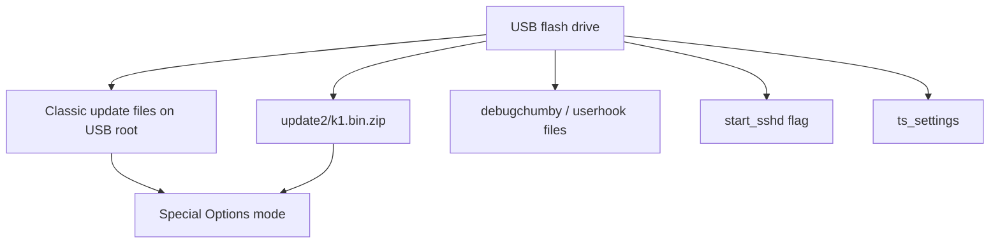

# Chumby Classic USB Boot and Recovery Knowledge Base

Scope: Chumby Classic / Ironforge USB update, USB startup, and recovery paths; the Chumby Wiki identifies Chumby Classic as Ironforge. [Source](https://wiki.chumby.com/index.php?title=Devices)

## Verified Facts

| Topic | Fact | Source |
| --- | --- | --- |
| External USB | Chumby Classic has two external USB 2.0 full-speed ports. | [Devices](https://wiki.chumby.com/index.php?title=Devices) |
| USB detail | The hardware page lists three USB 2.0 full-speed ports: one internal and two external. | [Hacking hardware](https://wiki.chumby.com/index.php?title=Hacking_hardware_for_chumby#What.27s_in_a_chumby_classic.3F) |
| Restore media | Firmware restore begins with a USB flash drive. | [Troubleshooting](https://wiki.chumby.com/index.php?title=Troubleshooting) |
| Classic update | Classic restore uses `http://files.chumby.com/resources/classic/1-7-3/update.zip`. | [Troubleshooting](https://wiki.chumby.com/index.php?title=Troubleshooting) |
| Classic layout | Classic update ZIP contents are unpacked and moved to the USB root. | [Troubleshooting](https://wiki.chumby.com/index.php?title=Troubleshooting) |
| Special Options | Firmware restore uses reboot while touching the screen to enter Special Options mode. | [Troubleshooting](https://wiki.chumby.com/index.php?title=Troubleshooting) |
| USB install menu | Firmware restore uses `Install updates` and `Install from USB flash drive`. | [Troubleshooting](https://wiki.chumby.com/index.php?title=Troubleshooting) |
| Update warning | The troubleshooting page warns not to unplug the device during update. | [Troubleshooting](https://wiki.chumby.com/index.php?title=Troubleshooting) |
| Kernel update layout | Classic kernel installation uses USB `update2/k1.bin.zip`. | [Hacking Linux](https://wiki.chumby.com/index.php?title=Hacking_Linux_for_chumby#Installing_the_kernel_image) |
| Kernel update entry | Classic kernel installation enters Special Options mode by holding the touchscreen during power-on for 5 seconds. | [Hacking Linux](https://wiki.chumby.com/index.php?title=Hacking_Linux_for_chumby#Installing_the_kernel_image) |
| Startup script | The Chumby tricks page says the easiest and safest startup customization is USB `debugchumby`. | [Chumby tricks](https://wiki.chumby.com/index.php?title=Chumby_tricks#Run_processes_on_start-up) |
| Startup hooks | `userhook0`, `userhook1`, and `userhook2` can be placed on USB root. | [Chumby tricks](https://wiki.chumby.com/index.php?title=Chumby_tricks#Run_processes_on_start-up) |
| USB SSH | An empty USB file named `start_sshd` starts SSH without permanent SSH startup. | [Chumby tricks](https://wiki.chumby.com/index.php?title=Chumby_tricks#Launching_sshd_at_startup) |
| Calibration recovery | A USB file named `ts_settings` can restore touchscreen calibration enough to navigate calibration UI. | [Chumby tricks](https://wiki.chumby.com/index.php?title=Chumby_tricks#Screwed_up_your_touchscreen_calibration.3F) |
| rcS recovery | USB `debugchumby` can remove `/psp/rfs1/rcS` after booting Special Options mode. | [Chumby tricks](https://wiki.chumby.com/index.php?title=Chumby_tricks#Running_something_at_boot_without_debugchumby_.28IronForge_Chumby_Classic_ONLY.29) |
| USB wait script | The stock tool list includes `wait_for_usb`. | [Software tools](https://wiki.chumby.com/index.php?title=Chumby_Software_Applications%2C_Scripts_and_Tools) |
| Mount monitor | The stock tool list documents mount monitor scripts `add.sh`, `mount.sh`, `remove.sh`, and `umount.sh`. | [Software tools](https://wiki.chumby.com/index.php?title=Chumby_Software_Applications%2C_Scripts_and_Tools) |
| USB Ethernet | Firmware 1.7 and later include Ethernet support with documented USB Ethernet examples. | [Chumby tricks](https://wiki.chumby.com/index.php?title=Chumby_tricks#Use_wired_Ethernet) |

## Diagram

The diagram summarizes sourced USB update and recovery entry points. [Troubleshooting](https://wiki.chumby.com/index.php?title=Troubleshooting), [Chumby tricks](https://wiki.chumby.com/index.php?title=Chumby_tricks#Run_processes_on_start-up), [Hacking Linux](https://wiki.chumby.com/index.php?title=Hacking_Linux_for_chumby#Installing_the_kernel_image)

## Assumptions

No assumptions are used as facts in this document.

## Open Questions

- Does HW 3.7 support booting a full Linux root filesystem from USB?
- What filesystems are accepted for USB recovery media?
- What exact USB mount path is used before `debugchumby` runs?
- What is the execution order of `debugchumby` and `userhook*` files?
- Can USB recovery repair a corrupted bootloader?
