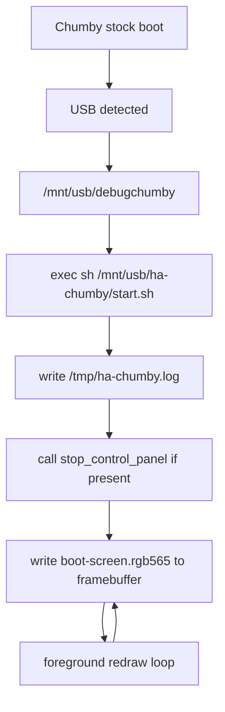

# Boot Persistence Design Note

Status: Sprint 4 design and implementation note.

Goal: keep HA-Chumby in control after USB `debugchumby` runs, without modifying internal flash and without implementing Home Assistant, alarms, or networking.

## Hardware Observation

Real Chumby Classic HW 3.7 testing showed this sequence:

1. Chumby boots normally.
2. USB stick is detected.
3. HA-Chumby's replacement `debugchumby` is executed.
4. `start.sh` is executed.
5. The HA-Chumby framebuffer boot screen appears briefly.
6. Stock Chumby software resumes and enters setup/calibration flow.

This proves the USB startup hook works, the framebuffer can be written, and internal flash is not required for the HA-Chumby boot proof.

## Source Findings

| Question | Finding | Source |
| --- | --- | --- |
| What launches `debugchumby`? | Chumby Wiki documents a USB root file named `debugchumby` as the easiest and safest way to run commands on startup. | [Chumby tricks: Run processes on start-up](https://wiki.chumby.com/index.php?title=Chumby_tricks#Run_processes_on_start-up) |
| Is `debugchumby` a supported persistent replacement for boot? | Chumby Wiki presents `debugchumby` as a startup command hook, not as a documented replacement for the whole stock boot process. | [Chumby tricks: Run processes on start-up](https://wiki.chumby.com/index.php?title=Chumby_tricks#Run_processes_on_start-up) |
| What happens after `debugchumby` exits? | Real hardware showed that stock firmware continues after HA-Chumby's backgrounded `debugchumby` exits. | Sprint 4 hardware observation |
| Which process starts the stock UI? | Chumby Wiki documents `start_control_panel` as the action responsible for starting the Control Panel in the correct mode. | [Chumby Software Applications, Scripts and Tools](https://wiki.chumby.com/index.php?title=Chumby_Software_Applications%2C_Scripts_and_Tools) |
| What does `start_control_panel` do? | The tools page says `start_control_panel` checks for updates on network and USB drives, checks/restarts the music player, erases the display, and starts the Control Panel Flash applet. | [Chumby Software Applications, Scripts and Tools](https://wiki.chumby.com/index.php?title=Chumby_Software_Applications%2C_Scripts_and_Tools) |
| Can the stock UI be stopped? | Chumby Wiki documents `stop_control_panel` as a stock action that stops the control panel widget from playing. | [Chumby Software Applications, Scripts and Tools](https://wiki.chumby.com/index.php?title=Chumby_Software_Applications%2C_Scripts_and_Tools) |
| Is replacing the Control Panel possible from USB? | Chumby Wiki documents using a USB `controlpanel.swf` or an older `debugchumby` invoking `chumbyflashplayer.x -i /mnt/usb/controlpanel.swf`. | [Chumby tricks: Using a custom Control Panel](https://wiki.chumby.com/index.php?title=Chumby_tricks#Using_a_custom_Control_Panel) |
| Is there a watchdog concern around the Control Panel? | Chumby Wiki says a custom Control Panel must write `1` to `/tmp/movieheartbeat` every 15 seconds to keep the watchdog from restarting the Control Panel. | [Chumby tricks: Using a custom Control Panel](https://wiki.chumby.com/index.php?title=Chumby_tricks#Using_a_custom_Control_Panel) |
| Is editing internal boot scripts safe? | Chumby Wiki warns that editing `/psp/rfs1/rcS` can break the boot procedure. | [Chumby tricks: Running something at boot without debugchumby](https://wiki.chumby.com/index.php?title=Chumby_tricks#Running_something_at_boot_without_debugchumby_.28IronForge_Chumby_Classic_ONLY.29) |

## Interpretation

The original Sprint 3 `debugchumby` started `start.sh` in the background and then exited. That matched the observed result: HA-Chumby drew the framebuffer, then the stock boot process continued and the stock UI overwrote the screen.

The safest no-flash fix is to stop treating `debugchumby` as a launcher that returns. For Sprint 4, `debugchumby` becomes a foreground handoff point: it locates HA-Chumby's USB startup script and uses `exec sh "$APP"`. This keeps HA-Chumby's process in the foreground and avoids returning control to the startup script that launched `debugchumby`.

`start.sh` is also long-running. It logs startup state, optionally calls `stop_control_panel` if that command exists, writes the boot screen, and redraws the framebuffer every two seconds. The redraw loop protects against late stock UI redraws during boot without modifying internal flash.

## Chosen Solution



Design decisions:

- Keep the USB startup path.
- Do not write to `/psp`, `/etc`, root filesystem, firmware partitions, or update partitions.
- Sprint 4 did not run Zurk's original `debugchumby`; Sprint 10 supersedes that narrow persistence test by running the preserved original Zurk startup after the HA-Chumby splash to restore web services.
- Keep Chumby-side runtime in shell.
- Avoid Python because writing a static framebuffer image is already sufficient.
- Redraw the framebuffer periodically because real hardware showed the stock UI can overwrite the screen after the first draw.
- Use `stop_control_panel` only if available because Chumby Wiki documents it as the stock way to stop the Control Panel.

## Expected Log

After boot, `/tmp/ha-chumby.log` should contain entries similar to:

```text
YYYY-MM-DD HH:MM:SS debugchumby: starting HA-Chumby USB entrypoint
YYYY-MM-DD HH:MM:SS debugchumby: found app at /mnt/usb/ha-chumby/start.sh
YYYY-MM-DD HH:MM:SS debugchumby: execing HA-Chumby app in foreground
YYYY-MM-DD HH:MM:SS start.sh: starting HA-Chumby persistent boot screen
YYYY-MM-DD HH:MM:SS start.sh: boot screen image found
YYYY-MM-DD HH:MM:SS start.sh: using framebuffer /dev/fb0
YYYY-MM-DD HH:MM:SS start.sh: initial boot screen written
YYYY-MM-DD HH:MM:SS start.sh: entering persistent foreground redraw loop
```

If `date` is not initialized correctly during early boot, timestamps may reflect the device's current local clock state. The log still proves execution order.

## Rejected Options

| Option | Reason rejected |
| --- | --- |
| Edit `/psp/rfs1/rcS`. | Chumby Wiki warns this can break boot, and it modifies persistent internal storage. |
| Replace internal Control Panel files. | This modifies internal firmware/storage and violates Sprint 4 constraints. |
| Use a custom Flash Control Panel. | This is documented, but it adds Flash packaging and watchdog heartbeat requirements that are unnecessary for the Sprint 4 boot proof. |
| Start HA-Chumby in background. | Real hardware showed that returning from `debugchumby` allows the stock UI to resume and overwrite the screen. |
| Add Python. | A shell script plus pre-rendered framebuffer image is sufficient for the required boot screen. |

## Open Questions for Hardware Validation

- Does foreground `exec` from `debugchumby` block the stock boot continuation on all tested Classic firmware states?
- Is `stop_control_panel` present during the exact moment `start.sh` runs on HW 3.7?
- Does the stock UI still overwrite the framebuffer after `debugchumby` stays foreground?
- Is a two-second redraw interval sufficient, or should it be longer after validation?
- Does `/tmp/ha-chumby.log` survive long enough for practical SSH inspection during failure cases?
