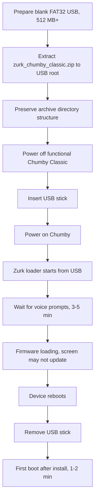

# USB Boot Guide: Chumby Classic with Zurk Offline Firmware

Status: Sprint 2 research and preparation guide.

Scope: Prepare a USB stick for the original Chumby Classic / beanbag HW 3.7 using Zurk's Offline Firmware. This guide does not download firmware, redistribute firmware, or implement application code.

## Source Priority

| Priority | Source | Why it matters |
| --- | --- | --- |
| 1 | [SourceForge ZDoc files / README.TXT](https://sourceforge.net/projects/zurk/files/) | SourceForge hosts Zurk's published files and the README text shown with the release listing. |
| 2 | [Chumby Wiki Troubleshooting: Firmware restore](https://wiki.chumby.com/index.php?title=Troubleshooting#Firmware_restore) | Chumby Wiki documents official USB firmware restore behavior and Special Options mode. |
| 3 | [Chumby forum: Zurk Offline Firmware thread](https://forum.chumby.com/viewtopic.php?id=7831) | Original Zurk discussion contains early usage notes and Classic compatibility history. |
| 4 | [Chumby forum: Zurk firmware summary](https://forum.chumby.com/viewtopic.php?id=8598) | Community summary confirms the practical USB-stick preparation pattern. |
| 5 | [Chumby Wiki: Chumby tricks](https://wiki.chumby.com/index.php?title=Chumby_tricks) | Chumby Wiki documents USB `debugchumby`, Special Options recovery, and SSH methods. |

## Recommendation

Use the later SourceForge README procedure for Zurk's Classic archive: prepare a blank FAT32 USB stick, extract the Classic ZIP contents to the USB root while preserving directory structure, boot a powered-off functional Chumby with the USB inserted, wait for the loader, and remove the USB after the loader-triggered reboot. [SourceForge README](https://sourceforge.net/projects/zurk/files/)

Do not use the older early-thread wording as the primary source for the final Classic procedure, because the forum post was edited during early development and the later SourceForge README says the Chumby Classic is no longer supported by current releases and should use the last Classic firmware, v21. [Forum thread](https://forum.chumby.com/viewtopic.php?id=7831), [SourceForge README](https://sourceforge.net/projects/zurk/files/)

## Verified Facts

| Topic | Verified fact | Source |
| --- | --- | --- |
| Zurk current README version | The SourceForge README text identifies Zurk's Offline Firmware as v34.0. | [SourceForge README](https://sourceforge.net/projects/zurk/files/) |
| Classic support status | The SourceForge README says the Chumby Classic is no longer supported by current Zurk releases. | [SourceForge README](https://sourceforge.net/projects/zurk/files/) |
| Classic Zurk archive | The SourceForge README directs Classic users to `zurk_chumby_classic.zip`. | [SourceForge README](https://sourceforge.net/projects/zurk/files/) |
| Classic Zurk version | The SourceForge README says the last Classic firmware is v21. | [SourceForge README](https://sourceforge.net/projects/zurk/files/) |
| Classic archive listing | SourceForge lists `zurk_chumby_classic.zip`, modified 2013-03-25, size 235.6 MB. | [SourceForge files](https://sourceforge.net/projects/zurk/files/) |
| USB format | Zurk's README requires a blank USB thumb drive formatted FAT32. | [SourceForge README](https://sourceforge.net/projects/zurk/files/) |
| USB capacity | Zurk's README requires 512 MB or greater. | [SourceForge README](https://sourceforge.net/projects/zurk/files/) |
| Extract location | Zurk's README says to unzip to the USB root folder. | [SourceForge README](https://sourceforge.net/projects/zurk/files/) |
| Directory structure | Zurk's README says to keep the directory structure. | [SourceForge README](https://sourceforge.net/projects/zurk/files/) |
| Chumby state before install | Zurk's README says to power off an activated, networked, functional Chumby before inserting the USB stick. | [SourceForge README](https://sourceforge.net/projects/zurk/files/) |
| First-time install recommendation | Zurk's README says activated and networked Chumby state is recommended for first-time installation, even though the offline firmware can operate without network afterward. | [SourceForge README](https://sourceforge.net/projects/zurk/files/) |
| Boot action | Zurk's README says to insert the USB thumb drive and power on. | [SourceForge README](https://sourceforge.net/projects/zurk/files/) |
| Installer feedback | Zurk's README says to wait for voice prompts, usually 3-5 minutes. | [SourceForge README](https://sourceforge.net/projects/zurk/files/) |
| USB removal point | Zurk's README says to remove the USB thumb drive when the Chumby reboots. | [SourceForge README](https://sourceforge.net/projects/zurk/files/) |
| First boot duration | Zurk's README says the first boot after install may take 1-2 minutes. | [SourceForge README](https://sourceforge.net/projects/zurk/files/) |
| Later boot duration | Zurk's README says later boots are faster than first boot. | [SourceForge README](https://sourceforge.net/projects/zurk/files/) |
| Upgrade behavior | Zurk's README says the same procedure is used when upgrading from an onboard Zurk firmware and the loader detects the earlier install. | [SourceForge README](https://sourceforge.net/projects/zurk/files/) |
| Screen update behavior | Zurk's README says the screen may not update during firmware installation. | [SourceForge README](https://sourceforge.net/projects/zurk/files/) |
| Install duration | Zurk's README says 10-15 minutes is the average time for firmware loading. | [SourceForge README](https://sourceforge.net/projects/zurk/files/) |
| Power safety | Zurk's README says not to unplug the Chumby during firmware loading. | [SourceForge README](https://sourceforge.net/projects/zurk/files/) |
| USB validation | Zurk's README says installation checks USB disk files and stops if files have issues such as corruption. | [SourceForge README](https://sourceforge.net/projects/zurk/files/) |
| USB recovery fallback | Zurk's README recommends replacing the USB disk or reformatting and retrying if file checks fail. | [SourceForge README](https://sourceforge.net/projects/zurk/files/) |
| Networkless mode | Zurk's README says deleting `autoreboot.on` from `/mnt/storage/zurk` enables network-less mode after install. | [SourceForge README](https://sourceforge.net/projects/zurk/files/) |
| Networkless consequence | Zurk's README says network-less mode is irreversible unless the software is reinstalled from USB. | [SourceForge README](https://sourceforge.net/projects/zurk/files/) |
| DLNA flag | Zurk's README says deleting `dlna.on` disables DLNA support. | [SourceForge README](https://sourceforge.net/projects/zurk/files/) |
| Web control panel | Zurk's README says browsing to the Chumby's IP address after boot opens a web control and information page. | [SourceForge README](https://sourceforge.net/projects/zurk/files/) |
| Web SSH control | Zurk's README says the web control page can start SSH. | [SourceForge README](https://sourceforge.net/projects/zurk/files/) |
| SSH hardening | Zurk's README recommends setting a root SSH password with `passwd root` on insecure networks. | [SourceForge README](https://sourceforge.net/projects/zurk/files/) |
| Chumby Classic official restore package | Chumby Wiki lists the Classic official restore package as `http://files.chumby.com/resources/classic/1-7-3/update.zip`. | [Chumby Wiki Troubleshooting](https://wiki.chumby.com/index.php?title=Troubleshooting#Firmware_restore) |
| Official Classic restore layout | Chumby Wiki says Classic official `update.zip` must be unpacked and all contents moved to the top level of the USB flash drive. | [Chumby Wiki Troubleshooting](https://wiki.chumby.com/index.php?title=Troubleshooting#Firmware_restore) |
| Official restore entry | Chumby Wiki says firmware restore enters Special Options mode by rebooting while touching the screen. | [Chumby Wiki Troubleshooting](https://wiki.chumby.com/index.php?title=Troubleshooting#Firmware_restore) |
| Official restore menu | Chumby Wiki says to press `Install updates`, then `Install from USB flash drive`, then confirm. | [Chumby Wiki Troubleshooting](https://wiki.chumby.com/index.php?title=Troubleshooting#Firmware_restore) |
| Official restore power safety | Chumby Wiki says not to unplug the Chumby during official firmware update. | [Chumby Wiki Troubleshooting](https://wiki.chumby.com/index.php?title=Troubleshooting#Firmware_restore) |
| Early Zurk compatibility | The original Zurk forum thread says v10.0 onward is compatible with the original Chumby Classic. | [Zurk forum thread](https://forum.chumby.com/viewtopic.php?id=7831) |
| Early root file | The original Zurk forum thread says the included `debugchumby` file must be on the USB root directory. | [Zurk forum thread](https://forum.chumby.com/viewtopic.php?id=7831) |
| Early customization path | The original Zurk forum thread says weather location can be modified by editing a profile in `www/xml` on the USB drive. | [Zurk forum thread](https://forum.chumby.com/viewtopic.php?id=7831) |
| Community size summary | A community forum summary says the Chumby One-class ZIP was about 212 MB and 303 MB uncompressed. | [Zurk summary forum](https://forum.chumby.com/viewtopic.php?id=8598) |
| Community USB summary | The same community summary says to unzip to a 512 MB or larger USB thumb drive, plug it in, and turn on. | [Zurk summary forum](https://forum.chumby.com/viewtopic.php?id=8598) |
| Stock debugchumby mechanism | Chumby Wiki says a USB `debugchumby` shell script is the easiest and safest way to run processes on startup. | [Chumby tricks](https://wiki.chumby.com/index.php?title=Chumby_tricks#Run_processes_on_start-up) |
| SSH from stock firmware | Chumby Wiki says the hidden Control Panel can launch `sshd`, and SSH login is root with no password after `sshd` starts. | [Chumby tricks](https://wiki.chumby.com/index.php?title=Chumby_tricks#Open_a_secure_shell_.28SSH.29_console_on_the_chumby) |
| Persistent stock SSH | Chumby Wiki says creating `/psp/start_sshd` starts `sshd` whenever the Chumby connects to a network. | [Chumby tricks](https://wiki.chumby.com/index.php?title=Chumby_tricks#Launching_sshd_at_startup) |

## Conflict Analysis

| Conflict | Evidence | Resolution |
| --- | --- | --- |
| Early forum wording suggests a USB-resident experience where removing the USB resets the Chumby. | The original forum usage notes say removing the USB flash drive and power cycling resets the Chumby. [Forum thread](https://forum.chumby.com/viewtopic.php?id=7831) | Treat this as early-version behavior. For Classic v21, follow the later SourceForge README, which says the loader installs firmware and the USB is removed after reboot. [SourceForge README](https://sourceforge.net/projects/zurk/files/) |
| Current Zurk v34 README lists Chumby One / Infocast 3.5 and Chumby 8 / Infocast 8 as current targets, but points Classic users to v21. | SourceForge README says current Classic is no longer supported and Classic users should download the last Classic firmware v21. [SourceForge README](https://sourceforge.net/projects/zurk/files/) | Use `zurk_chumby_classic.zip`, not `zurk_chumby_one.zip`, for a Chumby Classic HW 3.7. |
| Official Chumby restore uses Special Options mode, while Zurk README says insert USB and power on. | Chumby Wiki firmware restore uses touchscreen-held Special Options mode. [Chumby Wiki Troubleshooting](https://wiki.chumby.com/index.php?title=Troubleshooting#Firmware_restore) Zurk README says insert USB and power on. [SourceForge README](https://sourceforge.net/projects/zurk/files/) | Use Zurk's direct power-on flow for Zurk Offline Firmware. Keep official Special Options restore available as recovery or prerequisite factory firmware repair. |
| The SourceForge README gives latest factory firmware prerequisites for Chumby One and Chumby 8, but not an explicit Classic prerequisite version in that line. | SourceForge README lists `c1/i3.5 - v1.0.7` and `c8/i8 - v1.8.2`, while separately saying Classic should use last firmware v21. [SourceForge README](https://sourceforge.net/projects/zurk/files/) | For Classic, verify the device is functional before Zurk install. If factory repair is needed, use Chumby Wiki Classic official restore package `1-7-3/update.zip` before trying Zurk. [Chumby Wiki Troubleshooting](https://wiki.chumby.com/index.php?title=Troubleshooting#Firmware_restore) |

## Required USB Format

| Requirement | Value | Source |
| --- | --- | --- |
| Filesystem | FAT32 | [SourceForge README](https://sourceforge.net/projects/zurk/files/) |
| Capacity | 512 MB or greater | [SourceForge README](https://sourceforge.net/projects/zurk/files/) |
| Initial contents | Blank USB thumb drive before extraction | [SourceForge README](https://sourceforge.net/projects/zurk/files/) |
| Extraction target | USB root folder | [SourceForge README](https://sourceforge.net/projects/zurk/files/) |
| Directory handling | Preserve directory structure from the ZIP | [SourceForge README](https://sourceforge.net/projects/zurk/files/) |

## Required Directory Structure

The exact full manifest of `zurk_chumby_classic.zip` was not inspected because this sprint explicitly does not download firmware.

The required directory rule is still exact enough for hardware preparation: extract every file and directory from `zurk_chumby_classic.zip` directly to the USB root and preserve the archive's directory structure. [SourceForge README](https://sourceforge.net/projects/zurk/files/)

Known source-confirmed paths and files:

| Path | Required? | Evidence | Source |
| --- | --- | --- | --- |
| `/debugchumby` on USB root | Required by early Zurk forum instructions; expected inside the archive. | Zurk says to make sure included `debugchumby` is on the USB root directory. | [Zurk forum thread](https://forum.chumby.com/viewtopic.php?id=7831) |
| `/www/xml/` on USB stick | Known customization path in early Zurk instructions. | Zurk says to edit profile in `www/xml` on the USB drive for weather location. | [Zurk forum thread](https://forum.chumby.com/viewtopic.php?id=7831) |
| All other files from `zurk_chumby_classic.zip` | Required as archive contents. | Zurk README says to unzip to root and keep directory structure. | [SourceForge README](https://sourceforge.net/projects/zurk/files/) |

Do not create a partial USB stick by copying only `debugchumby` or only visible top-level files. The safest preparation is a full archive extraction preserving paths. [SourceForge README](https://sourceforge.net/projects/zurk/files/)

## Required Firmware Files

| File or package | Purpose | Source |
| --- | --- | --- |
| `zurk_chumby_classic.zip` | Zurk Offline Firmware package for Chumby Classic; SourceForge lists it as the Classic archive. | [SourceForge files](https://sourceforge.net/projects/zurk/files/) |
| Contents of `zurk_chumby_classic.zip` | Files that must be extracted to USB root with directory structure preserved. | [SourceForge README](https://sourceforge.net/projects/zurk/files/) |
| `debugchumby` from the Zurk archive | Startup script expected at USB root by early Zurk usage notes. | [Zurk forum thread](https://forum.chumby.com/viewtopic.php?id=7831) |
| `update.zip` from `classic/1-7-3` | Official Chumby Classic recovery package, not part of the Zurk USB unless doing factory restore first. | [Chumby Wiki Troubleshooting](https://wiki.chumby.com/index.php?title=Troubleshooting#Firmware_restore) |

## Supported Firmware Versions

| Item | Supported version information | Source |
| --- | --- | --- |
| Zurk current branch | SourceForge README identifies the current Zurk README as v34.0. | [SourceForge README](https://sourceforge.net/projects/zurk/files/) |
| Chumby Classic Zurk support | SourceForge README says Classic is no longer supported by current releases and should use the last Classic firmware v21. | [SourceForge README](https://sourceforge.net/projects/zurk/files/) |
| Early Classic compatibility | Original forum thread says v10.0 onward is compatible with the original Chumby Classic. | [Zurk forum thread](https://forum.chumby.com/viewtopic.php?id=7831) |
| Official Classic recovery firmware | Chumby Wiki lists Classic official recovery as `1-7-3/update.zip`. | [Chumby Wiki Troubleshooting](https://wiki.chumby.com/index.php?title=Troubleshooting#Firmware_restore) |
| Chumby One prerequisite in Zurk README | Zurk README says Chumby One / Infocast 3.5 should be on firmware v1.0.7 before offline firmware. | [SourceForge README](https://sourceforge.net/projects/zurk/files/) |
| Chumby 8 prerequisite in Zurk README | Zurk README says Chumby 8 / Infocast 8 should be on firmware v1.8.2 before offline firmware. | [SourceForge README](https://sourceforge.net/projects/zurk/files/) |

## Boot Sequence

Diagram sources: USB format, extraction, power-on flow, prompts, remove-after-reboot, and first-boot duration come from the SourceForge README. [SourceForge README](https://sourceforge.net/projects/zurk/files/)

## Step-by-Step Checklist

### A. Prepare the device

| Done | Step | Source |
| --- | --- | --- |
| [ ] | Confirm the target is an original Chumby Classic / beanbag device. | [Chumby Wiki Devices](https://wiki.chumby.com/index.php?title=Devices) |
| [ ] | Confirm the Chumby boots and is functional before installing Zurk firmware. | [SourceForge README](https://sourceforge.net/projects/zurk/files/) |
| [ ] | Prefer a networked and activated Chumby for first-time Zurk installation. | [SourceForge README](https://sourceforge.net/projects/zurk/files/) |
| [ ] | If the device is not functional, restore official Classic firmware first using Chumby Classic `1-7-3/update.zip`. | [Chumby Wiki Troubleshooting](https://wiki.chumby.com/index.php?title=Troubleshooting#Firmware_restore) |

### B. Prepare the USB stick

| Done | Step | Source |
| --- | --- | --- |
| [ ] | Use a USB thumb drive of at least 512 MB. | [SourceForge README](https://sourceforge.net/projects/zurk/files/) |
| [ ] | Format the USB thumb drive as FAT32. | [SourceForge README](https://sourceforge.net/projects/zurk/files/) |
| [ ] | Start with a blank USB thumb drive. | [SourceForge README](https://sourceforge.net/projects/zurk/files/) |
| [ ] | Obtain `zurk_chumby_classic.zip` from SourceForge manually. | [SourceForge files](https://sourceforge.net/projects/zurk/files/) |
| [ ] | Do not use `zurk_chumby_one.zip` for the Classic unless deliberately testing unsupported behavior. | [SourceForge README](https://sourceforge.net/projects/zurk/files/) |
| [ ] | Extract the entire ZIP to the USB root folder. | [SourceForge README](https://sourceforge.net/projects/zurk/files/) |
| [ ] | Preserve directory structure during extraction. | [SourceForge README](https://sourceforge.net/projects/zurk/files/) |
| [ ] | Confirm `debugchumby` exists at the USB root after extraction. | [Zurk forum thread](https://forum.chumby.com/viewtopic.php?id=7831) |
| [ ] | Do not rename files from the archive. | Derived from the SourceForge requirement to preserve directory structure. [SourceForge README](https://sourceforge.net/projects/zurk/files/) |

### C. Boot/install Zurk Offline Firmware

| Done | Step | Source |
| --- | --- | --- |
| [ ] | Power off the Chumby. | [SourceForge README](https://sourceforge.net/projects/zurk/files/) |
| [ ] | Insert the prepared USB stick. | [SourceForge README](https://sourceforge.net/projects/zurk/files/) |
| [ ] | Power on the Chumby. | [SourceForge README](https://sourceforge.net/projects/zurk/files/) |
| [ ] | Wait for voice prompts; Zurk README says this usually takes 3-5 minutes. | [SourceForge README](https://sourceforge.net/projects/zurk/files/) |
| [ ] | Do not assume failure just because the screen does not update during installation. | [SourceForge README](https://sourceforge.net/projects/zurk/files/) |
| [ ] | Do not unplug the Chumby while firmware is loading. | [SourceForge README](https://sourceforge.net/projects/zurk/files/) |
| [ ] | Allow 10-15 minutes for firmware loading. | [SourceForge README](https://sourceforge.net/projects/zurk/files/) |
| [ ] | When the Chumby reboots, remove the USB stick. | [SourceForge README](https://sourceforge.net/projects/zurk/files/) |
| [ ] | Allow 1-2 minutes for the first boot after install. | [SourceForge README](https://sourceforge.net/projects/zurk/files/) |

### D. First boot setup

| Done | Step | Source |
| --- | --- | --- |
| [ ] | Set the Control Panel time/location after boot. | [SourceForge README](https://sourceforge.net/projects/zurk/files/) |
| [ ] | Set brightness and sound preferences after boot. | [SourceForge README](https://sourceforge.net/projects/zurk/files/) |
| [ ] | Access the Chumby web control panel by browsing to the Chumby's IP address. | [SourceForge README](https://sourceforge.net/projects/zurk/files/) |
| [ ] | If using SSH on an insecure network, set a root password with `passwd root`. | [SourceForge README](https://sourceforge.net/projects/zurk/files/) |
| [ ] | After changing settings, run `sync` and reboot once before regular use. | [SourceForge README](https://sourceforge.net/projects/zurk/files/) |

## Recovery Procedure

### If Zurk install reports USB file problems

| Step | Source |
| --- | --- |
| Replace the USB disk or reformat the USB disk and retry. | [SourceForge README](https://sourceforge.net/projects/zurk/files/) |

### If the Chumby needs official firmware restore first

| Step | Source |
| --- | --- |
| Get a USB flash drive. | [Chumby Wiki Troubleshooting](https://wiki.chumby.com/index.php?title=Troubleshooting#Firmware_restore) |
| Use the Classic official firmware package `http://files.chumby.com/resources/classic/1-7-3/update.zip`. | [Chumby Wiki Troubleshooting](https://wiki.chumby.com/index.php?title=Troubleshooting#Firmware_restore) |
| For Chumby Classic only, unpack the ZIP and move all contents to the USB root. | [Chumby Wiki Troubleshooting](https://wiki.chumby.com/index.php?title=Troubleshooting#Firmware_restore) |
| Insert the USB drive into the device. | [Chumby Wiki Troubleshooting](https://wiki.chumby.com/index.php?title=Troubleshooting#Firmware_restore) |
| Reboot while touching the screen to enter Special Options mode. | [Chumby Wiki Troubleshooting](https://wiki.chumby.com/index.php?title=Troubleshooting#Firmware_restore) |
| Press `Install updates`. | [Chumby Wiki Troubleshooting](https://wiki.chumby.com/index.php?title=Troubleshooting#Firmware_restore) |
| Press `Install from USB flash drive`. | [Chumby Wiki Troubleshooting](https://wiki.chumby.com/index.php?title=Troubleshooting#Firmware_restore) |
| Confirm and do not unplug the device while updating. | [Chumby Wiki Troubleshooting](https://wiki.chumby.com/index.php?title=Troubleshooting#Firmware_restore) |

### If access is needed before or after Zurk installation

| Method | Source |
| --- | --- |
| Use hidden Control Panel `SSHD` to launch the built-in SSH daemon on stock firmware. | [Chumby tricks](https://wiki.chumby.com/index.php?title=Chumby_tricks#Hidden_screen_in_Control_Panel) |
| Log in as `root` with no password after `sshd` starts on stock firmware. | [Chumby tricks](https://wiki.chumby.com/index.php?title=Chumby_tricks#Open_a_secure_shell_.28SSH.29_console_on_the_chumby) |
| Create `/psp/start_sshd` for persistent SSH start on stock firmware after network connection. | [Chumby tricks](https://wiki.chumby.com/index.php?title=Chumby_tricks#Launching_sshd_at_startup) |

## Files That Must Eventually Be Added to the USB Stick

Because this sprint does not download firmware, this section names every source-confirmed required file or file set without pretending to know the uninspected archive manifest.

| USB item | Required for | Source |
| --- | --- | --- |
| Every file and directory extracted from `zurk_chumby_classic.zip` | Zurk Classic USB preparation. | [SourceForge README](https://sourceforge.net/projects/zurk/files/) |
| `debugchumby` at USB root, from the Zurk archive | Zurk early usage path and Chumby startup hook mechanism. | [Zurk forum thread](https://forum.chumby.com/viewtopic.php?id=7831), [Chumby tricks](https://wiki.chumby.com/index.php?title=Chumby_tricks#Run_processes_on_start-up) |
| `www/xml/` from the Zurk archive | Optional weather/profile customization path documented in early Zurk notes. | [Zurk forum thread](https://forum.chumby.com/viewtopic.php?id=7831) |
| Official Classic `update.zip` contents at USB root | Official firmware recovery only, not Zurk installation. | [Chumby Wiki Troubleshooting](https://wiki.chumby.com/index.php?title=Troubleshooting#Firmware_restore) |

## Things This Guide Does Not Do

- It does not download `zurk_chumby_classic.zip`.
- It does not download official Chumby firmware.
- It does not redistribute firmware files.
- It does not implement Home Assistant integration.
- It does not add Chumby runtime application code.

## Open Questions

| Question | Why it remains open |
| --- | --- |
| What is the exact full file manifest of `zurk_chumby_classic.zip`? | The sprint forbids downloading firmware, so the archive contents were not inspected. |
| Does Classic v21 install fully to internal storage or keep any runtime dependency on USB? | SourceForge README describes removing USB after reboot, while early forum wording describes reset by removing USB. The later SourceForge README is recommended until hardware testing proves otherwise. |
| Which exact stock firmware version should a Classic HW 3.7 have before installing Zurk v21? | SourceForge README names prerequisites for Chumby One and Chumby 8 but not an explicit Classic stock version; Chumby Wiki lists Classic official restore `1-7-3/update.zip`. |
| Does the Classic v21 loader produce voice prompts on all HW 3.7 devices? | SourceForge README documents voice prompts generally, but hardware-specific audio behavior has not been tested in this project. |
| Can the install be safely repeated after a failed partial install? | SourceForge README says the loader detects earlier onboard firmware and upgrades, but this project has not tested partial-failure recovery. |
